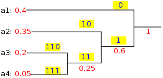
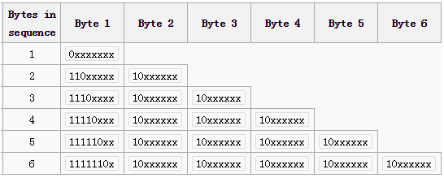

* TOC
{:toc}

## Arrays - Two pointers - Two Sum, Two Diff

### Question1 - Two Diff : unsorted input

Two difference, find all pairs(number of indexes pairs) values difference ($|A[i] - A[j]|$) to a target, where target > 0, with/without duplicates?
what if the array is unsorted?

> The same as two sum, use a HashSet to store the visited value, converted to a problem of searching an exact value

1. Go through the input array
2. We are trying to find `A[i] - A[j] == target || A[j] - A[i] == target`, A[j] : visited element, A[i] : current element)
3. `so A[j] =  (A[i] - target || A[i] + target)`

`Time: O(n), Space: O(n)`
``` java
public int twoDiff_Unsorted(int[] A, int target) {
	int cnt = 0;
	Set<Integer> visited = new HashSet<>();
	for (int num : A) {
		if (visited.contains(num - target) || visited.contains(num + target))
			cnt++;
		visited.add(num);
	}
	return cnt;
}
```

### Follow-up: Sorted input

What if the array is sorted?

> Also like two sum, using two pointers i and j, both start at the beginning of input, make sure j >= i, the difference can be found by advancing either A[i] or A[j], because it's **sorted**, we can use its property of monotonicity to guarantee that we can find all the answers.

1. A[j] - A[i] is the difference that we will search
2. If the diff is greater than target, then we decrease it by advancing i
3. Else the diff is smaller than target, then we increase it by advancing j
4. Go through the input list and stops when j reach the end.

`Time: O(n), Space: O(1)`
```java
public int twoDiff_Sorted(int[] A, int target) {
	int cnt = 0;
	for (int i = 0, j = 1; j < A.length;) {
		if (A[j] - A[i] == target) {
			cnt++;
			i++;
			j++;
		} else if (A[j] - A[i] > target)
			i++;
		else
			j++;
	}
	return cnt;
	}
```

---

### Question2 - Find all A + B + C = D

Given an int array, find if(all) there are 4 elements in the array such that A + B + C = D. (all positive numbers) Sorted Array.

`D is the largest one → three sum`
We fix D, and we converted it to a 3-Sum problem (`A + B + C = constant?`). We try all the possible D from the 4th element to the end element.

`Time: O(n^3), Space: O(1)`

> When we have multiple variables,  we can try to fix some variables, so that we can convert it to a problem we know how to solve.


### Variant - Find all A + B = C + D

Given an int array, find if (all) there are 4 elements in the array such that A + B = C + D.
Sorted array
> We fix A and B, so that it is converted to a two sum problem, `C + D = target ?`.

{1, 2, 3, 4}
A     C     D     B
For a sorted array, `A, B must be the largest and smallest, C, D are in the middle`, so that we can find a two sum equals to A + B.

`Time: O(n^3), Space: O(1)`

```java
  for (int i = 0; i < input.length - 3; i++) { // A
    for (int j = i + 3, j < input.length; j++) { // B
      twosum();  // C + D
    }
  }
```

**Why it works?**
Proof :
Let's say C < D and A < B,  naively there are 6 cases:
1. A < C < D < B
2. C < A <  B < D
3. A < B < C < D
4. C < D < A < B
5. A < C < B < D
6. C < A < D < B

Cases 3 ~ 6 can be easily proved that either A + B > C + D or A + B < C + D by the monotonicity of addition (E.g. A < C && B < D --> A + B < C + D).
Cases 1 ~ 2 are the same, we just logically split it to two cases, they are actually the same one relationship of four random numbers, we just choose this way (A < C < D < B) to traverse the array.

---

### Question3 - Two Diff from two arrays

Given two sorted array A and B, if there exist two numbers a from A and b from B, such that \|a-b\| = target.

> Simplify the goal by case analysis.
> The key is to decompose the absolute operation


>	 Two cases:
>	 Suppose A[i] > B[j] --> do a two diff on A[i] - B[j]
>	 Suppose A[i] < B[j] --> do a two diff on B[j] - A[i]

Two pointers walk through two array, two times, two cases.
`E.g.  A[]: 1 3 4 5 9 11, B[]: 2 3 4 6 7 8 10`
	1  2  3  3  4  4  5  6  7  8  9  10  11
	A  B A  B  A  B  A  B  B  B  A  B    A
	i
	&nbsp;&nbsp;&nbsp;&nbsp;j

`Time: O(m + n), Space: O(1)`
```java
	public boolean diff2(int[] A, int[] B, int target) {
		int ia = 0, ib = 0;
		// suppose A[ia] > B[ib]
		while (ia < A.length && ib < B.length) {
			if (A[ia] - B[ib] < target)
				ia++;
			else if (A[ia] - B[ib] > target)
				ib++;
			else
				return true;
		}
		// suppose A[ia] < B[ib]
		while (ia < A.length && ib < B.length) {
			if (B[ib] - A[ia] < target)
				ib++;
			else if (B[ib] - A[ia] > target)
				ia++;
			else
				return true;
		}
		return false;
	}
```

---

### Question4 - Find the minimum of |x-y| + |y-z| + |z-x|

3 sorted arrays A, B, C, from each of the arrays pick one element, x from A, y from B, z from C, what is the minimum \|x-y\| + \|y-z\| + \|z-x\|.

`One way to think about |x-y| is the distance of x and y on an axis.`

`Find the minimum of |x-y| + |y-z| + |z -x| is to find the *closest three points on an axis* from A, B, C.`

Basically the same as two diff.
1. Use three pointers start at the beginning of each Array.
2. Each time we advance the pointer that has the smallest value, update the global Minimum at the same time.

`Time: O(n), Space: O(1)`
```java
public int minDiff3(int[] A, int[] B, int[] C) {
	int min = Integer.MAX_VALUE;
	for (int i = 0, j = 0, k = 0; i < A.length || j < B.length || k < C.length;) {
		int a = i == A.length ? A[i - 1] : A[i];
		int b = j == B.length ? B[j - 1] : B[j];
		int c = k == C.length ? C[k - 1] : C[k];
		min = Math.min(min, distance(a, b, c));

		if (i < A.length && (j == B.length || A[i] <= B[j]) && (k == C.length || A[i] <= C[k]))
			i++;
		else if (j < B.length && (i == A.length || B[j] <= A[i]) && (k == C.length || B[j] <= C[k]))
			j++;
		else
			k++;
	}
	return min;
}
```

---

### Question5 - Pick three elements in an array to form a triangle

Given an integer array with all positive integer values.
Can we pick three elements in the array as the lengths of edges, to construct any triangle?

*Triangle - three edges a, b, c, must apply:  *
*a + b > c && b + c > a && c + a > b*

> *What if a, b, c is sorted? → a <= b <= c,  a + b > c*

If we have a sorted array of positive integers,  can we `pick three consecutive elements in the array as a, b and c, such that a + b < c?`

` Time: O(nlogn), Space: O(1)`

```java
public boolean canConstructTriangle(int[] A) {
	Arrays.sort(A);
	for (int i = 2; i < A.length; i++) {
		if (A[i - 2] + A[i - 1] > A[i])
			return true;
	}
	return false;
}
```

### Follow-up: How many triangles can we get from the array?

> Convert it → How many pairs(a, b) of values in an integer array such that a + b > target?
> `Two sum problem`

0. Sort the input array
1. For a + b > c, we first fix c, try different c form A[2] to A[n - 1]
2. For each c = A[i], we convert it to the problem of finding how many pairs of (a, b) such that a + b > c
3. Using two pointers l and r run towards each other,  l start from 0, r start from i - 1. (`Two Sum`)
4. Two cases while running,
	5. A[l] + A[r] > A[i], in which case we know there are r - l pairs valid, advance r, decrease the sum
	6. A[l] + A[r] <= A[i], invalid, advance l to increase the sum

`Time: O(n * n), Space: O(1)`
```java
public int countTriangle(int[] A) {
	Arrays.sort(A);
	int count = 0;
	for (int i = 2; i < A.length; i++) {
		for (int l = 0, r = i - 1; l < r; ) {
			if (A[l] + A[r] > A[i]) {
				count += r - l;
				r--;
			} else
				l++;
		}
	}
	return count;
}
```
---

## Arrays - Precomputation sums

### Question1 - Subarray Sum, exists

Given integer array, find the subarray, the sum = target.  Does it exist?
`input: int[] A, int target.`
>**Basically it's trading space for time:**
*Use a HashSet to store precomputed sums[0...j], and any subarray sum can be computed by:*
`sum[0...i] - sum[0...j] =  sum[j...i] =?  target`

1. Calculate sum[0...j] first
2. Any subarray sum[j...i] can be calculated by sum[0...i] - sum[0...j]

`Time:O(n), Space:O(n)`

```java
int sum = 0; // current sum, sum[0...i]
Set<Integer> visited = new HashSet<>(); // store sum[0...j]
for (int i = 0; i < length; i++) {
	sum += A[i]; // sum[0...i]
	// looking for sum[j...i] = sum[0...i] - target
	if (visited.contains(sum - target))
		return true;
	visited.add(sum);
}
return false;
```

### Follow-up 1:  How many subarrays

How many subarrays equals the target?
1. The question is converted to count all the pairs (i, j) in the precomputed *sums[]* that  sums[i] - sums[j] = target
2. We still should use a HashTable/Set to boost look up time to O(1).
3. Compare to Q1, we just use a HashMap instead of HashSet, use its value to store the count of visited sums.

`Time: O(n), Space: O(n)`
```java
int res = 0; // count of pairs
int sum = 0;
// store value of sum[0...j] as key, count as value
Map<Integer, Integer> visited = new HashMap<>();
for (int i = 0; i < length; i++) {
	sum += target; // sum[i]
	// looking for sum[j] = sum[i] - target
	if (visited.containsKey(sum - target))
		res += visited.get(sum - target);
	// update count
	Integer cnt = visited.get(sum);
	if (cnt == null)
		cnt = 0;
	visited.put(sum, cnt + 1);
}
return res;
```

### Follow-up 2: Closest to a 0

 Find the subarray sum, that the sum is closest to a 0.
`input: int[] A, int target`
>- This time Hash won't work cause it can only lookup exact (=) values, can't do >  or < value search.
>- subarray  closest to 0 --->  A[i] - A[j] closest to 0 ---> A[i] and A[j] are closest.
> - **Whenever we see closest, <, >, distance etc., we should think about sorting or sorted data structure, because it will make things easier.**

1. Use an array `int sums[]` to store all the precomputed sums[0...i].
2. Then it's converted to find the smallest difference of two consecutive values in an array:
	a. Sort the *sums* array, keep a global min difference
	b. 	Go through the sorted array sums[], compare adjacent value, calculate the difference, update global Diff.

`Time: O(nlogn), Space: O(n)`

```java
int[] sums = new int[length]
sums[0] = A[0];
for (int i = 1; i < length; i++) {
	sums[i] += sums[i - 1] + A[i];
}
Arrays.sort(sums);
int minDiff = 0; // closest subarray sum to 0
for (int i = 1; i < length; i++) {
	minDiff = Math.min(minDiff, sums[i] - sums[i - 1]);
}
return minDiff;
```

---

### Question2 - Exist duplicate within k indices

Given an array，check if there are duplicates elements within k indices，return true，else return false.

> Within k indices ---> maintain a K size window, use a HashSet to store the values in the window

`Time: O(n), Space: O(k)`
```java
public boolean existsDup(int[] A, int k) {
	Set<Integer> window = new HashSet<>();
	for (int i = 0; i < A.length; i++) {
		if (i >= k)
			window.remove(A[i - k]);
		if (!window.add(A[i]))
			return true;
	}
	return false;
}
```

### Follow-up - Exist a | difference | of two numbers < T within K indices

Check if there are two elements that their |difference| is less than T within K indices.

- less than T ---> HashSet/Table won't work
- within K indices ---> sliding window
- | two difference | ---> classic two pointers way to solve two-diff won't work because it's sliding window and not sorted.
- | two difference | ---> can be viewed as distance, which means **the distance of two points** within K indices which < T.

#### Method 1 --- BST Window

> Because we are looking for | difference | **< T**, it's a **range search** for any difference < T basically.
> **We can do it much easier if it is sorted**, and because it's a sliding window, it's hard to sort it in place.
> Therefore, we can maintain a sorted window of K elements using BST.
> Every time we insert a new element, we use BST to search the closest number to the new element in the window.

BST has two related functions :
- ceiling(K key), closest key equal or larger
- floor(K key), closest key equal or smaller

`Time: O(nlogk), Space: O(k)`
```java
public boolean exists(int[] A, int k, int t) {
	Set<Integer> window = new TreeSet<>();
	for (int i = 0; i < A.length; i++) {
		if (i >= k)
			window.remove(A[i - k]);
		Integer ceilVal = window.ceiling(A[i]);
		if (ceilVal != null && ceilVal - A[i] < t)
			return true;
		Integer floorVal = window.floor(A[i]);
		if (floorVal != null && A[i] - floorVal < t)
			return true;

		window.add(A[i]);
	}
	return false;
}
```

#### Method 2 --- Hash Bucket Window

What is possible to optimize and what we want to optimize:
Time Complexity:    O(n * logk) → optimize to O(n)
Space Complexity:  O(k)

> Optimize from O(n * logk) ---> O(n), in which case BST can't be used, and possible data structure should be Hash related.

We use T as the bucket size, and hash each value to different bucket.
E.g. T = 3:

| Bucket: (Key)	| 0 		|  1  		| 2 	| ... |
| :-------- | :--------:| :------: | :--------:| :------: |
| Value range: (Value)|	0 ~ 2	|	3 ~ 5	| 6 ~ 8	| ... |

In this case, we only need to check the bucket contains the value and the two neighbor buckets.

1. Use a HashMap from Bucket Number to one of the values. There won't be two values at the same bucket, because if so it must have already satisfied this condition; | difference | of two numbers < T, and returned)
2. Maintain such a window, whenever insert a new element, check its bucket and its neighbor buckets, they are the only possible numbers that could have the difference < T.

> We can use this kind of method (**Hash Value to Bucket, same range in the same bucket**) when we see something like this **| two number's difference | < T **

```java
public boolean exists(int[] A, int k, int t) {
	Map<Integer, Integer> window = new HashMap<>();
	for (int i = 0; i < A.length; i++) {
		if (i >= k)
			window.remove(A[(i - k)/t]);
		// check current element if already exists
		int currBkt = A[i] / t;
		if (window.containsKey(currBkt))
			return true;
		// check neighbors
		Integer left = window.get(currBkt - 1);
		if (left != null && A[i] - left < t)
			return true;
		Integer right = window.get(currBkt + 1);
		if (right  != null && right - A[i] < t)
			return true;
		window.put(currBkt, A[i]);
	}
	return false;
}
```

---

## Priority Queue

### Basics

#### When to use?

1. kth smallest/largest,  smallest/largest k
2. min/max, median
3. Best first search

#### Properties

- O(1) get min/max
- O(logn) insert
- O(logn) remove min/max
- **O(n) search for value**
`maintain an auxiliary HashMap, can make search(value) to O(1) time`
Below are not in the default APIs of Java/C++:
- update(index)
- update(value)
- remove(index)
- remove(value)

#### Implementation (必考)

- complete binary tree
- array

**Key functions**
- **percolateUp**
```java
// for a min-heap, assume A[] starts from 0
int size; // current size of A
public void percolateUp(int[] A, int i) {
	while (i > 0) {
		int parent = (i - 1) / 2;
		if (A[i] >= A[parent])
			break;
		swap(A, i, parent);
		i = parent;
	}
}
```
- **percolateDown**
```java
// for a min-heap, assume A[] starts from 0
int size; // current size of A
public void percolateDown(int[] A, int i) {
	int son = 2 * i + 1; // left son first
	while (son < size) {
		if (son + 1 < size && A[son} > A[son + 1])
			son++; // choose right (the smaller one)
		if (A[i] <= A[son]) // if less than the smallest
			break;
		swap(A, i, son);
		i = son;
		son = 2 * i + 1;
	}
}
```
- heapify
- poll
- offer
- peek

#### Heap sort

- Time: O(n) best case, O(nlogn) worst case, Space: O(1)
- Not stable

#### Compare with Balanced Binary Search Tree

| function | Priority Queue | BST |
| :--------: | :--------:| :------: |
| peekMax    |   minHeap --> O(n) <br/> maxHeap --> O(1) |  O(logn)  |
| peekMin    |   minHeap --> O(1) <br/> maxHeap --> O(n) |  O(logn)  |
| insert    |   O(logn) |  O(logn)  |
| search    |   O(n) |  O(logn)  |
| update    |   by index --> O(logn) <br/> by value --> O(search)  |  O(logn)  |
| delete min |   minHeap --> O(logn) <br/> maxHeap --> O(n) |  O(logn)  |
| delete max |   minHeap --> O(n) <br/> maxHeap --> O(logn) |  O(logn)  |
| delete    |   by index --> O(logn) <br/> by value --> O(search)  |  O(logn)  |

There will be a lot of scenarios that using PriorityQueue and using BST is interchangeable.

##### The benefits of Priority Queue:

- get max/min is O(1), but get min/max is O(n)

##### The benefits of BST:

- update / delete arbitrary value is O(logn)
- **floor() / ceiling is amortized O(1) (given the current node)**
- lookup is O(logn)

---

### Top K problems

- k-th smallest/largest element in unsorted array.
- k smallest/largest elements in unsorted array.
- the k points in 3-d space closest to point of (0, 0, 0)
- the most k frequent visited urls

E.g. k-th smallest element in an unsorted array.

#### Method 1 - Heapify a minHeap + poll k times

- `O(n + klogn), good for big n small k`
- `Need to read all the data in memory to do heapify, not suitable for large data`

#### Method 2 - Build a maxHeap of size n + poll() max once

- `O(nlogk), good for small n big k`
- `It's a good external algorithm, only need O(k) memory`
- `Good for streaming data, easy to be distributed`

#### Method 3 - Quick select

- `Average O(n), Worst case O(n^2)`
- `Not a good external algorithm as well, need to read all data in`

---

### Q1.Find the k-th smallest sum from k arrays

K sorted array, each has size n >= 1, pick one element from each of them to build a sum, find the kth smallest sum.

```java
public int kSmallSum(int[][] arrays) {
	int k = arrays.length;
	PriorityQueue<Tuple> pq = new PriorityQueue<Tuple>(
		public int compare(Tuple t1, Tuple t2) {
			return t1.sum - t2.sum;
		}
	);
	Set<Tuple> visited = new HashSet<>();
	int sum = 0;
	for (int i = 0; i < k; i++)
		sum += arrays[i][0];
	pq.add(new Tuple(sum, new int[k]));
	while (!pq.isEmpty()) {
		// ....
	}
}
```

##### Partial sorted array of k diff sorted

```java
public void sortKDiff(int[] A, int k) {
	PriorityQueue<Integer> minHeap = new PriorityQueue<>();
	for (int i = 0; i <=k; i++)
		minHeap.add(A[i]);
	for (int i = 0; i < A.length; i++) {
		A[i - k] = minHeap.poll();
		if (i + k + 1 < A.length)
			minHeap.add(A[i + k + 1];)
	}
}
```

---

### Q2.Median of stream data flow at any time

maintain two Heaps,  one minHeap, one maxHeap.

**x% percentile of stream data flow**
It's a more general form of median of stream. (median is 50% percentile.)

---

### Q3.To implement some ID poll

implement a pool of integers (IDs) range from [0, 10000], provides APIs:
- int **checkOutMinID()** :  retrieve the smallest available ID, the ID will be removed from the pool.
- bool **returnID(int)** : return the ID to the pool so that it can be available again.
- bool **checkOutID(int)** : check out a specific ID, return false if it is not available.

**Solution:  minHeap<ID> + HashMap<ID, Index> or TreeSet<ID> (Balanced BST)**
Heap + HashMap:
maintain a minHeap, when initialization, put all available IDs into the minHeap.
- checkOutMinID() --> minHeap.poll();  `Time: O(logn)`
- returnID(int) --> minHeap.offer(int id); `Time: O(logn)`

and a int[] idMap (or HashMap<Integer, Integer>), map from Integer as ID to Integer as Index of the heap element.
- checkOutID(int id) --> minHeap.deleteAtIndex(idMap[id]), delete both in Map and Heap . `Time: O(logn)`

E.g. Code example:
```java
if (id in the map) {
	int index = map.get(id); // O(1)
	// O(percoloateDown) == O(mapUpdates) == O(logn)
	removeAtIndex(index); // at the same time update Map
} else // O(1)
	return false;
```

Details of the implementation by TreeSet is much easier. (ignored)

---

### Q4.To implement a data structure that can insert(), median, delete()

- void insert(int)  --> insert a new element
- int median() --> get the median of all the inserted elements
- void delete(int) --> delete one element from it

Heap(Array) + HashMap --> O(logn). much complex when involving delete(), need to implement delete() yourself to achieve O(logn)
TreeMap --> delete() --> O(logn), median --> O(logn).

**Solution: Sliding window of median numbers**
Only need one TreeSet
1. initialize the TreeSet with the first k elements
2. Find the initial median
3. Traverse the array, each step, add right element then remove left element; **The tricky part**:
 - *If the element added and the element removed are on the same side of the median, median won't change, remain the same.*
 - *If the element added < median and element removed > median  --> median is the left neighbor node, TreeSet.prev(median).*
 - *If the element added > median and element removed < median --> median is the right neighbor node, TreeSet.next(median).*

#### [Huffman Encoding](http://en.wikipedia.org/wiki/Huffman_coding)





The simplest construction algorithm uses a priority queue where the node with lowest probability is given highest priority:

1. Create a leaf node for each symbol and add it to the priority queue.
2.  While there is more than one node in the queue:
 1. Remove the two nodes of highest priority (lowest probability) from the queue
 2. Create a new internal node with these two nodes as children and with probability equal to the sum of the two nodes' probabilities.
 3. Add the new node to the queue.
3. The remaining node is the root node and the tree is complete.

Since efficient priority queue data structures require O(log n) time per insertion, and a tree with n leaves has 2n−1 nodes, this algorithm operates in `O(n log n) time`, where n is the number of symbols.

| Symbol | Code |
| :-------: | :-------:|
| a1 | 0 |
| a2 | 10 |
| a3 | 110 |
| a4 | 111 |


---

## Single Number & Swap

### Q1.single number exists once, other numbers all exist twice?

#### Method 1 - HashSet, add & remove:

Using HashSet, add to the HashSet if the HashSet not contains the value, if the HashSet already contains the value, remove it from the HashSet. The remaining element will be the answer.
`Time: O(n), Space: O(n)`

#### Method 2 - bit manipulation, xor

XOR, since num1 ^ num1 = 0, traverse the array and do XOR.
`Time: O(n), Space O(1)`

#### Method 3 - count 1s of every bit

record number of 1s for each bit,  for each bit count, count = count % 2:
	if the bit count is odd, then --> 1
	if the bit count is even, then --> 0
`Time: O(32n), Space: O(32)`

### Follow-up 1, if the number range from [1, n], given the array of size n - 1

#### Method 4 - sum all the number

### Follow-up 2, two numbers exist once, other numbers all exist twice

#### Naive solution: Use Method 1

#### better solution: variant of Method 2

	Suppose the missing two numbers are x and y, and x != y
	1.xor all = x ^ y
	2.find the first bit where they differ
	3.use that bit to partition the list to two lists
		partition1: { all the numbers whose kth bit is 0 } --> contains x
		partition2: { all the numbers whose kth bit is 1 } --> contains y
	4.x and y must lies in different list
	5.xor each list, we will get the result.

### Follow-up 3, one number exists once, all other numbers exist three times

#### Naive solution: variant of Method 1, HashMap, and scan twice

#### Better solution: Method 3, count bits then % 3

#### Best solution: variant of Method 2,  

Like Method 2 ---> how to let every three "1"s to be 0 ?

Two bits to record how many "1"s have seen so far.
00 -->  01 --> 10 --> 11 <=> 0

Use two integer variables to record the first bit and the second bit.
0       0
two one
For Variable One:
one + next value
0 + 0 = 0
0 + 1 = 1
1 + 0 = 1
1 + 1 = 0
==>  one ^ value = next one

For Variable Two, it depends on One:
1. one == 1 && val == 1 --> two = 1
2. two == 1 --> two = 1
```java
int one = 0;
int two = 0;
for (int val : input) {
	two |= one & val;
	one ^= val;
	// if two and one are (1, 1), they will be set to (0, 0)
	int three = one & two;
	// three will be 1 only if one == 1 && two == 1
	one &= ~three; // <==> one ^= three
	two &= ~three; // <==> two ^= three
}
```

### Follow-up 4, given integer array, only one number exists twice, other once, all the number are in the range of [1, n]

#### Use method 2, XOR [1, n]

---

### Q2.Given an array contains n - 1 integers, only one number is missing from [1, n].

Example: {3, 1, 5, 4}, n = 5, return 2

#### Method 1 - XOR [1, n]

#### Method 2 - Swap - a[i] = i + 1

{3, 1, 5, 4} --> {1, 5, 3, 4}

```
public int findMissing(int[] A) {
	for (int i = 0; i < A.length; i++) {
		if (A[i] != i + 1 && A[i] <= A.length) {
			swap(A, i, A[i] - 1)
			i--;
		}
	}
	for (int i = 0; i < A.length; i++) {
		if A[i] != i + 1)
			return i + 1;
	}
	return A.length + 1;
}
```

### Follow-up 1: First missing positive in an arbitrary int array

```
public int findMissing(int[] A) {
	for (int i = 0; i < A.length; i++) {
		if (A[i] != i + 1 && A[i] <= A.length && A[i] != A[A[i] - 1]) {
			swap(A, i, A[i] - 1);
			i--;
		}
	}
	for (int i = 0; i < A.length; i++) {
		if A[i] != i + 1)
			return i + 1;
	}
	return A.length + 1;
}
```

### Follow-up 2: First missing positive in an sorted int array

#### Solution: binary search

---

### Q3.Given a value array with its corresponding position array, swap back the value array.

Example:
value = {1, 2, 3}, pos = {2, 1, 0}  --> {3, 2, 1}

###### Solution: swap

Traverse the array:
if pos[i] != i, then **swap value[] and pos[] at the same time** and stay put
else continue
```java
public void swapBack(int[] values, int[] pos) {
	assert values.length == pos.length;
	for (int i = 0; i < values.length; i++) {
		if (pos[i] != i) {
			swap(values, i, pos[i]);
			swap(pos, i, pos[i]);
			i--;
		}
	}
}
```
---

## Byte Array/Streams

### Q1.Is valid UTF-8

Determine if an byte array is valid UTF-8 string?


	Be careful corner cases:
	1.the first byte is invalid
	2.the rest of the bytes is short
	3.one of the rest of the bytes is invalid

```java
public boolean isUTF8(byte[] A) {
	for (int i = 0; i < A.length; i++) {
		byte first = A[i];
		int len = length(first);
		if (len < 0 || i + len >= A.length) // case 1 & 2
			return false;
		while (len > 0) {
			if ((A[++i] & (byte) 0b11_00_00_00) != (byte) 0b10_00_00_00) // case 3
				return false;
			len--;
		}
	}
	return true;
}

/**
 * Return the length of consecutive 1s start from left
 * valid length is from [0, 6]
 */
private int length(byte b) {
	int len = 0;
	while (((b >> 7) & 1) == 1) {
		b <<= 1;
		len++;
	}

	return len > 6 ? -1 : len;
}
```

---

### Q2.Read k bytes by read 4096 bytes (Frequent)

// sequentially read on file
// guarantee the buffer size = 4096
// return actually how many bytes read
Given read4k, implement read() k bytes into buffer by calling read4k()
`int read4k(byte[] buffer) {
	assert buffer.length == 4096;
}`

The difficult part is the last read
Solution --> Cases analysis:
1. readLen == 4096, k < 4096
2. readLen < 4096
```java
int read(byte[] buffer, int k) {
	assert buffer.length == k;
	byte[] buf4k = new byte[4096];
	int len = 0; // total read length
	while (len < k) {
		int readLen = read4k(buf4k);
		int copySize = min(k - len, readLen); // only for the last read
		copy(buf4k, 0, buffer, len, copySize);
		totalLen += copySize;
		if (readLen < 4096)
			break;
	}
	return totalLen;
}
```

### Follow-up 1 : Repeatedly called read()

Now the read() can be called repeatedly for the same file
```java
// read4k() changes to class FileReader4K {}
class FileReader4K {
	public FileReader4K(File file) {
		// ... initialize
	}

	// this is actually read4k() and you can call this consecutively
	// to traverse down the whole file
	public int read(int[] buffer) {
		// ...
	}
}
```
*Solution:*
Case analysis:
1. **k <= rest** --> read k bytes, move buff4k to left k bytes, rest -= k
2. **k > rest** --> read all rest bytes in buff4k, at last read, there are several cases to handle:
 1. when copy buff4k to buffer, the copy *length = min(readSize, k - len)*
 2. when the bytes needed (*k - len*) is less than the number of bytes has read in buff4k[] (*readSize*), we also need to move the rest of bytes that are not read in buff4k to the beginning and update rest counter.
 3. the readSize < 4096, has reach the end of the file

```java
class FileReader {
	FileReader4K reader4k;
	byte[] buff4k;
	int rest; // how many effective bytes left to read in buff4k
	public FileReader(File file) {
		reader4k = new FileReader4K(file);
		buff4k = new byte[4096];
		rest = 0;
	}

	// use the reader4k's read method and this method can also called
	// consecutively to traverse the whole file
	// return the length of bytes has read
	public int read(int[] buffer, int k) {
		assert buffer.length == k;
		if (k <= rest) {
			arrayCopy(buff4k, 0, buffer, 0, k);
			arrayCopy(buff4k, k, buff4k, rest - k); // rotate left
			rest -= k;
			return k;
		} else {
			int len = 0; // total read length
			arrayCopy(buff4k, 0, buffer, 0, rest); 	// copy rest of buff4k
			len += rest;  
			rest = 0;
			// then read k - rest by calling read4k()
			while (len < k) {
				int readSize = reader4k.read(buff4k);
				int copyLen = Math.min(readSize, k - len);
				arrayCopy(buff4k, 0, buffer, len, copyLen);
				len += copyLen;
				if (copyLen < readSize) { // don't forget!
					// move rest bytes to the beginning of buff4k (rotate left)
					rest = readSize - copyLen;
					arrayCopy(buff4k, copyLen, buff4k, 0, rest);
				}
				if (readSize < 4096) // the end of the file
					break;
			}
			return len;
		}
	}
}
```

---

### Q3.Parsing message format

[4][ msg ] [4] [msg] .... [4] [msg]
byte array for a stream of messages,  the format is every 4 bytes determine the length of the message in byte, followed by the number of length of messages.

void **emit**(byte[] msg);
// once parsed a message, use emit() to process message
void **accept**(byte[] stream) {}

```java
void accept(byte[] data) {
	int i = 0; // index of data[]
	while (i + 4 < data.length) {
		int length = (data[i] << 24) | (data[i + 1] << 16) | (data[i + 2] << 8) | data[i + 3];
		if (i + length < data.length)
			break;	// error, data is not enough
		byte[] msg = new byte[length];
		for (int j = 0; j < length; j++, i++) // reading data
			msg[j] = data[i];

		emit(msg);

	}
}
```

### Follow-up 1: now the accept() changed, it accepts a stream of data

```java
int length = 0; // msg length
byte[] msg;
int cnt = 0;	// byte count of a msg including the first 4 bytes
void accept (byte b) {
	if (cnt < 4) {
		length |= (b << (3 - cnt) * 8);
		cnt++;
	} else {
		if (cnt == 4)
			msg = new byte[length];
		msg[cnt - 4] = b;
		cnt++;
		if (cnt == length + 4) {
			emit(msg);
			cnt = 0;
			length = 0;
			msg = null;
		}
	}
}
```


## Dynamic Programming

### What kind of problems to solve?

min/max,
sum,
yes/no,
all results,
....

`The problem can be easily separated into small steps with the same problem description.`

**A big hint**: if the problem can be resolved by recursion, each step in recursion depends on one or several previous smaller steps’ result.

**Another big hint**: if you can not find a reasonably better solution than brute force/recursion.

> 本质 Dynamic Programming is nothing special than the brute force solution, essentially it just does the memorization of the partial solutions so that later we can reuse the partial solutions instead of computing them again. The key is trading time complexity with space complexity for the optimization.

`Key Points:`
**State**: the partial solution for the same problem with smaller size.
What does the state mean?
    state[i] / state[i][j] / …...
How to get the state?
problem patterns, similar typical problems(已经总结好的常见类型)
try out each of the most frequently used ones.
`try to find the brute force solution first, and find which part is duplicated and can be optimized.`

**Function (Induction rule)**: how to use the solution of the problem with smaller size to solve the problem with larger size.
`Hint: the function is usually how the recursion is done.`
Function sometimes is not “identical”, and usually it is determined along with how to define the state, for the same problem we could have multiple possible states and functions definition, and there might be one among all of these which is the most optimal.

**Base case**: what are the initial states to start?
`Hint: in recursion, there should be a termination state.`

**Answer**:
How the answer is related to one/all of the states.

**Order of filling the solution:**
how the Function is defined, what are the cells state[i][j] depends on.

**Optimization:**
Time: usually depends on how your state is chosen.
Space: identify the duplicated spaces needed.


### Q1.Steal money on street problem

There are several rooms and in each of the rooms there is some amount of money (non-negative).
There is an alert system such that if we steal the money from two adjacent rooms, the alert will fire. What is the max amount of money we can safely have?  (You can only steal non-adjacent rooms)

**Solution**
**State:**  M[i] : the max amount of money we have steal from A[0 ...i], no guarantee steal A[i].
**Base case:**  M[0] = A[0]
**Induction rule:**  M[i] = max(M[i - 1], M[i - 2] + A[i])

`Optimal, Time: O(n), Space: O(1)`
```java
public int maxProfit(int[] A) {
	if (A.length < 2)
		return A.length == 1 ? A[0] : 0;
	int[] M = new int[A.length];
	M[0] = A[0];
	M[1] = max(A[0], A[1]);
	int max = max(M[0], M[1]);
	for (int i = 2; i < A.length; i++) {
		M[i] = max(M[i-1], A[i] + M[i-2]);
		max = M[i] > max ? M[i] : max;
	}
	return max;
}

/******** Space Improved ********/
public int maxProfit(int[] A) {
	int M0 = A[0], M1 = A[1], Mi = 0;
	int max = max(M0, M1);
	for (int i = 2; i < A.length; i++) {
		Mi = max(M0 + A[i], M1);
		M0 = M1;
		M1 = Mi;
		max = Mi > max ? Mi : max;
	}
	return max;
}
```

### Q2.Determine last bit of byte stream

Given a byte array, which is an encoding of characters. Here is the rule:
a. If the first bit of a byte is 0, that byte stands for a one-byte character
b. If the first bit of a byte is 1, that byte and its following byte together stand for a two-byte character
Now implement a function to decide if the last character is a one-byte character or a two-byte character

**Solution:**
1. if the last byte is 1 → two-byte character,  if (A[n - 1] == 1) return false;
2. A[n - 1] == 0

**State:** m[i]: if the last byte can be one-byte character, for the subarray(i, A.length - 1)
**Induction rule:**
m[i] = A[i] == 1 → m[i + 2],  A[i] == 0 → m[i +1]
**Result:** m[0]
**Base case:** m[n - 1] = true, m[n - 2] = (A[n - 2] == 0)

`Time : O(n) ,Space: O(n)`

`Optimization:`
0 0 → result = m[i + 1]   *// break ealiear*
1 0
0 1
1 1

```java
if (A[n - 1] == 0) {
  m[n - 1] = true;
  m[n - 2] = A[n - 2] == 0;
  for (int i = n - 3; i >= 0; i--) {
     if (A[i] == 1) {
       m[i] = m[i + 2];
     } else {
       if ( i > 1 && A[i - 1] == 0)
	       return m[i + 1]; //  0 0
       m[i] = m[i + 1];
     }
  }
}
```

---

### Q3.Longest Increasing Subsequence (Frequent)

**Method - 1**
`Time: O(n^2), Space: O(n)`
**State:** M[i] = max *length* of increasing subsequence of A[0...i], include i
**Base case:** M[0] = 1
**Induction Rule:**  M[i] = max(M[j]) + 1, for all j such that j < i && A[j] < A[i]

**Method - 2**
`Optimal Time O(nlogn)`
M[i]: {1, 2, 4} the smallest end element of all the increasing subsequence having length i.

### Follow-up1.Find the number of increasing subsequences

`Time: O(n^2), Space: O(n)`
**State:** M[i] = max *number of increasing subsequence* of A[0...i], include i
**Induction Rule:**  M[i] = sum(M[j]), for j < i && A[j] < A[i]

### Follow-up2.Reconstruct the path

`Time: O(n^2), Space: O(n)`
Still the same M[i] as Q2, need one more pointer array:
`backIndex[i]: the last index of the longest subsequence ended at index i.`

### Variant1.2D Space, lines

Set of points in 2D space, how to find the largest subset of points such that, each of the lines conducted by any pair of points in the subset has positive slope?

> **Positive slope**  --> (y2 - y1) / (x2 - x1) > 0 -->  (y2 > y1 && x2 > x1 ) ||  (y2 < y1 && x2 < x1)

**Solution**
1. sort the points by x coordinate
2. find the longest increasing subsequence of y coordinate

**Variant1.1 - Squares:** (the exact same solution)
Set of envelopes, each one has (length, width), we can put e1 into e2 iff e2.length > e1.length && e2.width > e1.width. What is the maximum number of envelopes we can put in one stack.

### Variant2.3D Boxes

Set of boxes, each one has (length, width, height), we want to put them as a stack, when we put none box b2 on another box b1, we need to guarantee that b2.length < b1.length && b2.width < b1.width.
What is the max height we can get?

**Induction rule:** M[i] = height[i] + max(M[j])

### Variant3.Max sum of non-overlap Intervals

We have a list of records, each record has (start, end, weight). find a subset of the records, such that there is no overlap, and the sum of weight is maximized.

**Induction rule:** M[i] = Max( M[k] ) + weight[i], k is any next non-overlap record

### Variant4.Minimum number of move operations needed to form a sorted array.

We have a permutation of number 1 - n, we can delete one number and insert it to any other position, if we want to do several such operations to make the permutation as sorted, what is the minimal number of operations we will need?

> Max number of elements not needed to be moved --> Find the longest increasing subsequence


---

### Q4.Largest subarray sum

`Optimal Time: O(n), Space: O(1)`
**State:** M[i] = largest subarray sum of A[0, i], include A[i].
**Induction rule:** M[i] = max(A[i], M[i-1] + A[i]);

### Variant1.Largest submatrix sum

> Flat the matrix, convert it to 1D array --> largest subarray sum

`Time: O(m*m*n), Space: O(n)`
```java
public int largest(int[][] A) {
	int res = Integer.MIN_VALUE;
	int M = A.length, N = A[0].length;
	int[] cur = new int[N]; // current max sum
	for (int start = 0; start < M; start++) { // start row, fix top border
		for (int i = start; i < M; i++) { // current row
			add(cur, A[i]); // add from start row to the end row
			res = Math.max(res, max(cur)); // max sum of subarray
		}
		Arrays.fill(cur, 0);
	}
	return res;
}

private void add(int[] cur, int[] add) {
	for (int i = 0; i < cur.length; i++)
		cur[i] += add[i];
}
```

### Variant2.Largest submatrix product (float, positive, negative)

```java
/**
 * Time: O(m*m*n), Space: O(n)
 * Same as largest submatrix sum
 * Try every top and bottom rows combinations, then two borders are fixed,
 * converted it to a max subarray product problem.
 */
public double largest(double[][] A) {
	int M = A.length, N = A[0].length;
	double[] cur = new double[N];
	double res = Integer.MIN_VALUE;
	for (int start = 0; start < M; start++) {
		Arrays.fill(cur, 1);
		for (int i = start; i < M; i++) {
			multiply(cur, A[i]);
			res = Math.max(res, maxSubarrayProduct(cur));
		}
	}
	return res;
}

private double maxSubarrayProduct(double[] cur) {
	if (cur.length == 0)
		return Double.MIN_VALUE;
	double max = cur[0], min = cur[0], res = cur[0];
	for (int i = 1; i < cur.length; i++) {
		double maxCopy = max;
		max = Math.max(cur[i], Math.max(cur[i] * max, cur[i] * min));
		min = Math.min(cur[i], Math.min(cur[i] * maxCopy, cur[i] * min));
		res = Math.max(max, res);
	}
	return res;
}

private void multiply(double[] cur, double[] mul) {
	for (int i = 0; i < cur.length; i++) {
		cur[i] *= mul[i];
	}
}

```

### Variant3.Flip bit segment to get max 1s

Given an array has only 1 and 0, you can choose a segment[l, r], and flip the segment, how do you do it to get the max number of 1s?

> Find the largest subarray that (## of 0) - (## of 1) is the largest
> View 0 as 1, 1 as -1 --> largest subarray sum

### Variant4.Diff of number of 0s and 1s

Given an array containing only 0 and 1s. Find the subarray, such that, the diff of number of 1, 0s are the largest.
> Still → 0 =>1, 1 => -1
> max(**largest subarray sum**, abs(**smallest subarray sum**))


### Variant5.Equals number of 0s and 1s

Given 1, 0 array, longest subarray contains equal number of 0 and 1.
> Still → 0 =>1, 1 => -1
> Longest subarray sum equals to 0 + **pre-computation sum**


### Q5 Longest Increasing Subarray

**M[i]** : longest increasing subarray end at i, include i
M[0] = 1
M[i] = A[i] > A[i-1] ? M[i-1] + 1 : 1;

### Follow-up - Longest increasing subpath in binary tree

Path: form root to any leaf
&nbsp;&nbsp;&nbsp;&nbsp;3
&nbsp;&nbsp;1 &nbsp;&nbsp; 6
&nbsp;2 5 &nbsp; 4 1
3
Sub-Path output: 1 2 3

`Time: O(n)`
```java
// DP idea, use the result of parent node for children nodes
// Top-down update globalMax, DFS
int globalMax;
public int longest(TreeNode root) {
	globalMax = 0;
	longest(root, Integer.MIN_VALUE, 0); // update globalMax
	return globalMax;
}
private void longest(TreeNode root, int parentVal, int length) {
	if (root == null) { // reach leaf
		globalMax = length > globalMax ? length : globalMax;
		return;
	}
	length = root.val > parentVal ? length + 1 : 1;
	longest(root.left, root.val, length);
	longest(root.right, root.val, length);
}
```

### Follow-up - Longest increasing path in 2d matrix

**Input**:
1 2 3 4
3 4 5 2
1 3 2 1

**Output**: 5 (1 2 3 4 5)

> It's more general than above tree problem (tree is a special graph).
> DFS + Memorization

`Time: O(mn)`
```java
private void longestPath(int[][] mat)
	int[][] M = new int[m][n];
	int max = 0;
	for (int i = 0; i < m; i++) {
		for (int j = 0; j < n; j++) {
			if (M[i][j] == 0) {
				int length = longestPath(mat, i, j, M, Integer.MIN_VALUE);
				max = Math.max(length, max);
			}
		}
	}
}

// Bottom-Up DFS
private int longestPath(int[][] mat, int i, int j, int [][] M, int prevVal) {
	if (i < 0 || j < 0 || i >=m || j >= n || prevVal >= mat[i][j])
		return 0;
	if (M[i][j] > 0)
		return M[i][j];
	int length = 0;
	length = max(longestPath(mat, i + 1, j, M, mat[i][j]) + 1, length);
	length = max(longestPath(mat, i - 1, j, M, mat[i][j]) + 1, length);
	length = max(longestPath(mat, i, j + 1, M, mat[i][j]) + 1, length);
	length = max(longestPath(mat, i, j - 1, M, mat[i][j]) + 1, length);
	return length;
}
```

### Q6 Shortest list of integers, sum of square to the target number

For example, target = 14
14 = 1^2 + 2^2 + 3^2,  (1,2,3)
14 = 1^2 + 1^2 + 2^2 + 2^2 + 2^2 (1,1,2,2,2)
(1, 2, 3) is the shortest.


### Q7 Paint House

Minimize the cost of painting K houses, each house has different costs to paint in different colors, 2 houses (next to each other) cannot be painted in the same color.

### Variant - 30 days in K casinos

### Q8
