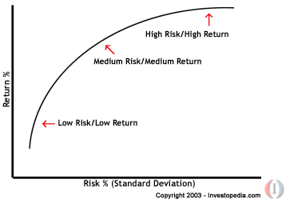

---

title: Computational Investing [class notes]
date: 2017-03-17 10:19:28
tags: coursera, investing, course

---

# Computational Investing [class notes]

* TOC
{:toc}

## Portfolio Management and Market Mechanics (week 1)

### Incentives of portfolio manager

two types of incentives

1. Mutual fund, ETF etc.
	* incentive: **expense ratio**, usually less than 1% of the fund -> attract more investors
2. hedge fund
	* incentive: **two and twenty**, 2% * fund + 20% * profits -> attract + growth

### Metrics for assesing fund performance

#### Common metrics

* Annual return
* Risk
	1. **Standard deviation of return**
	2. **Draw down**: how much it went down (max), difference between that trailing high point and the current low point.
	3. **Sharpe ratio**: reward / risk (include both upward and downward deviation)
	4. **Sortino ratio**: reward / risk (exclude upward deviation)
* Jensen's Alpha

#### Sharpe ratio

> a very important metric on assessing performance

***Definition***:

**a combination of return / risk**

$$
S = { E[R - R_f] \over \sqrt{var[R - R_f]}}
$$

* S: sharpe ratio
* E: expected return of
* R(f): risk free return, low risk, guaranteed return, need to be subtracted because it's guaranteed
* var: variation

***Simplified version***: `k * mean(daily return) / stdev(daily return)`

* stdev: standard deviation
* k: sqrt{250) for daily returns, 250 the number of trading days in a year, 250 for daily, 12 for monthly
* dividing *stdev(daily return) by k* to calculate the stdev of daily return

### How Prices Move Up and Down

### Computing structure inside a hedge fund

// TODO: fill this up after finishing week2

-----

## Company Worth and Capital Assets Pricing Model (Week 2)

### What is a Company Worth?

multiple methods of estimating a compnay's value:

* **Market cap**: # shares outstanding * price
* **Future dividends**
* **Book value**

#### Intrinsic value measured by future dividends

future income generated by the asset, and discounting it to the present value

$$
\sum_{i=1}^{\infty} dividend * gamma^i = {dividend * 1 \over (1 - gamma)}
$$

`gamma: discount rate (<1), how much the company is trustworthy? `

#### Why/How does information/news affect price?

`Key: copmany's profitability`

E.g.
* CEO effectiveness
* Cost of raw materials

#### Fundamental analysis

* **Book value**: how much a company is worth if it ceased operating today, sold all its assets and paid off all its debts
	- total assets - (intangible assets (patents, goodwill) + liabilities)
* **Future returns**: "intrinsic" value or future revenue

the fundamental approach is to say let's see what the *book value* is, let's look at the value of *future revenue*. **Put those two together**, and that's what a company's worth.

### Capital Assets Pricing Model

> a model that describes the relationship between **systematic risk** and **expected return** for assets, particularly stocks

[Read more: Capital Asset Pricing Model - CAPM Definition](http://www.investopedia.com/terms/c/capm.asp#ixzz4d7vUGBzY)

#### General idea

`Expected Return = Time value of money + Risk`

$$ r_a = Time Value + Risk $$
$$ = r_f + \beta_a * (Risk Premium) $$
$$ = r_f + \beta_a * (r_m - r_f) $$

* $$r_f$$: Risk-Free rate, usually is a 10-year goveronment bond rate
* $$\beta_a$$: beta of the security, usually measured by stock volatility
* $$r_m$$: expected market return

#### CAPM assumptions

* Return on stock has two components
	- Systematic (the market, usually mean S&P 500 in this class)
	- Residual ($$\alpha_a$$): expected value = 0, or is random

$$
r_a = \beta_a r_m + \alpha_a
$$

> however, hedge fund manager thinks $$\alpha_a$$ is predictable.

#### What is beta?

A measure of the volatility, or systematic risk, of a security or a portfolio.

Think of beta as the tendency of a security's returns to respond to swings in the market.

[Read more: Beta - Complete Guide To Investment Companies, Funds And REITs](http://www.investopedia.com/walkthrough/fund-guide/introduction/1/beta.aspx#ixzz4d9s2Llt6)

* **beta > 1** indicates that the security's price will be more volatile than the market.
* **beta = 1** indicates that the security's price will move with the market.
* **0 < beta < 1** means that the security will be less volatile than the market.

* **beta = 0** regardless of which way the market moves, the value of cash remains unchanged. It could mean that the stock either is a new issue or doesn't yet have a beta calculated for it. (E.g. In Yahoo finance)
* **beta < 0** indicate an inverse relation to the market - which is possible but highly unlikely.

> **Beta** and **Correlation** are different!

Correlation is related to correlation coefficient

> Excess returns, are returns greater than the marktet, can only be accomplished if the beta of your portolio is greater than one.
> Also keep in mind: greater beta, greater risk

---

## Manipulating Data in Python and QSTK (week 3)

---

## Efficient Markets Hypothesis and Event Studies, Portfolio Optimization and the Efficient Frontier (week 4)

### 3 versions of Efficient Markets Hypothesis

* weak
* semi-strong
* strong

[Investopedia](http://www.investopedia.com/terms/e/efficientmarkethypothesis.asp)
[wikipedia](https://en.wikipedia.org/wiki/Efficient-market_hypothesis)

#### Weak-form efficiency

Current prices reflect all past public available information

* prohibits profit from technical analysis

#### Semi-strong-form efficiency

Weak + price instantly change to reflect new public information

* prohibits profit from technical analysis and fundamental analysis

#### Strong-form efficiency

Semi-strong + prices instantly reflect even hidden or "insider" information

* prohibits profit from insider information

### Portfolio optimization

optimizae for portiolio's **reward** and **risk**

#### Mean Variance optimization

* **mean**: return
* **variance**: risk
* **optimization**: find the balance between them

Model's **input**:

* **Expected return** for each equity
* **Volitility(risk)** for each equity
* **Target return**
* **Covariance matrix**: for each equity, how does that equity vary compared to the one

**Output**: Portfolio weights that minimize risk for target return

[Investopedia: Coorelation Coefficient](http://www.investopedia.com/terms/c/correlationcoefficient.asp)

### Efficient frontier

The efficient frontier (or portfolio frontier) is a concept in modern portfolio theory introduced by Harry Markowitz in 1952.

It refers to investment portfolios which occupy the 'efficient' parts of the risk-return **spectrum**. Formally, it is the set of portfolios which satisfy the condition that no other portfolio exists with a higher expected return but with the same standard deviation of return.

[Investopedia: efficientfrontier](http://www.investopedia.com/terms/e/efficientfrontier.asp)

[Extended reading: Capital Market Line](http://www.investopedia.com/terms/c/cml.asp)

the Capital Market Line(CML) is **better** than the efficient frontier because it **considers** the infusion of a **risk-free asset** in the market portfolio.

---

### Covariance vs Coorelation [side topic]

#### Covariance

Covariance is a measure of how much two random variables vary together. It’s similar to variance, but where variance tells you how a single variable varies, co variance tells you how two variables vary together.

$$
Cov(X, Y) = {\sum{(x_i - \bar{X}) (y_i - \bar{Y})} \over (n - 1)}
$$

A large covariance can mean a strong relationship between variables. **However, you can’t compare variances over data sets with different scales (like pounds and inches)**. A weak covariance in one data set may be a strong one in a different data set with different scales.

[statisticshowto/covariance](http://www.statisticshowto.com/covariance/)

The problem with covariances is that they are **hard to compare**.
The solution to this is to '**normalize**' the **covariance**: you divide the covariance by something that represents the diversity and scale in both the covariates, and end up with a value that is assured to be between -1 and 1: the correlation.

[correlation-and-covariance](https://stats.stackexchange.com/questions/18082/how-would-you-explain-the-difference-between-correlation-and-covariance)

#### Coorelation Coefficient

Correlation coefficients are used in statistics to measure how strong a relationship is between two variables. There are several types of correlation coefficient: Pearson’s correlation or Pearson correlation is a correlation coefficient commonly used in linear regression.

**Pearson correlation**

$$
r = {
\sum_{i = 1}^n{( x_i - \bar{X}} ) \sum_{i = 1}^n{( y_i - \bar{Y}} )
\over
\sqrt {\sum_{i = 1}^n{(x_i - \bar{X})^2}} \sqrt {\sum_{i = 1}^n{(y_i - \bar{Y})^2}}
}
$$

Alternative formulae:

$$
r = { \sum{x_i y_i} - n \bar{X} \bar{Y} \over{(n-1) S_x S_y} }
$$

where $$ S_x, S_y $$ is standard deviation of x and y

[Wiki/Correlation coefficient](https://en.wikipedia.org/wiki/Correlation_coefficient)
[statisticshowto/Correlation coefficient](http://www.statisticshowto.com/how-to-compute-pearsons-correlation-coefficients)

#### Advantages of the Correlation Coefficient

The Correlation Coefficient has several advantages over covariance for determining strengths of relationships:

* **Covariance** can take on practically **any number** while a **correlation** is limited: **-1 to +1**.
* Because of it’s numerical limitations, **correlation** is **more useful** for determining **how strong** the relationship is between the two variables.
* **Correlation** does **not** have **units**. **Covariance** always has **units**
* **Correlation** **isn’t** affected by changes in the center (i.e. **mean**) or **scale** of the variables

---

## (week 5)

---

## (week 6)

### Fundamental law

---

## (week 7)

### Technical Analysis

#### Three branches

* Sentiment indicators
	- "emotions of inestors"
* Flow of funds indicators
	- How much cash has been flowing "in" or "out"
	- What is the capacity of the market to buy or sell
* Market structure indicators
	- Most indicators fall in this group

#### Indicators

* Simple Moving Average
* Moving Aveage Convergence Divergence(MACD)
* Bollinger Band

---
