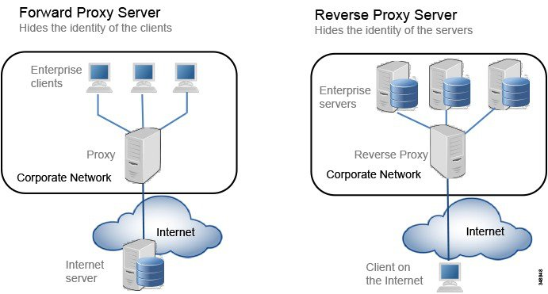

# Tech knowledge dump

[toc]

## Week 04/24/2016

### KeyStore vs TrustStore

* **keystore**, in which you have the private key and cert you prove your own identity with
* **truststore**, which determines who you trust

your own identity also has a 'chain' of trust to the root - which is separate from any chain to a root you need to figure out 'who' you trust.

Reference: [Stackoverflow: unable-to-find-valid-certification-path-to-requested-target-error](http://stackoverflow.com/questions/9210514/unable-to-find-valid-certification-path-to-requested-target-error-even-after-c)

### Commands for debugging SSL related issue

#### Print/List/Import certs

```bash
keytool -printcert -v -file /etc/pki/java/cacerts

keytool -list -file /etc/pki/java/cacerts

keytool -importcert -trustcacerts -keystore /etc/pki/java/cacerts -storepass changeit -alias connectifier-dev -file /etc/ssl/certs/connectifier.crt

sudo $JAVA_HOME/bin/keytool -importcert -trustcacerts -keystore /etc/riddler/cacerts -storepass changeit -alias connectifier-dev -file /etc/ssl/certs/connectifier.crt

```

#### Test truststore after importing

send a SSL http request to a specified url with specified truststore

```bash
java -Djavax.net.debug=all -Djavax.net.ssl.trustStore=/etc/riddler/cacerts SSLPoke local.connectifier.com 443
```

SSLPoke is a Java class file which need to be downloaded

---

### Forward proxy vs Reverse proxy

#### Differences


---



#### Use Case

**Both**:

* single point of access and control
  - firewall(whitelist, blacklist)
  - hide identity
  - request header edit/rewrite
* cache (static content)

**Forward proxy**

* monitoring and filtering
  - content-control
  - bypassing filters and censorship
  - logging and eavesdropping
* translation
* accessing services anonymously (e.g. TOR or FreeNet)

**Reverse proxy**

* load balancing
* traffic routing
* A/B testing and multivariate testing
* SSL encryption
* optimizing speed by compressing content

[Forward-Proxy-vs-Reverse-Proxy](http://www.jscape.com/blog/bid/87783/Forward-Proxy-vs-Reverse-Proxy)

[Stackoverflow: difference-between-proxy-server-and-reverse-proxy-server](http://stackoverflow.com/questions/224664/difference-between-proxy-server-and-reverse-proxy-server)

---


### Covariance vs Coorelation

#### Covariance

Covariance is a measure of how much two random variables vary together. It’s similar to variance, but where variance tells you how a single variable varies, co variance tells you how two variables vary together.

$$$
Cov(X, Y) = {\sum{(x_i - \bar{X}) (y_i - \bar{Y})} \over (n - 1)}
$$$

A large covariance can mean a strong relationship between variables. **However, you can’t compare variances over data sets with different scales (like pounds and inches)**. A weak covariance in one data set may be a strong one in a different data set with different scales.

[statisticshowto/covariance](http://www.statisticshowto.com/covariance/)

The problem with covariances is that they are **hard to compare**.
The solution to this is to '**normalize**' the **covariance**: you divide the covariance by something that represents the diversity and scale in both the covariates, and end up with a value that is assured to be between -1 and 1: the correlation.

[correlation-and-covariance](https://stats.stackexchange.com/questions/18082/how-would-you-explain-the-difference-between-correlation-and-covariance)

#### Coorelation Coefficient

Correlation coefficients are used in statistics to measure how strong a relationship is between two variables. There are several types of correlation coefficient: Pearson’s correlation or Pearson correlation is a correlation coefficient commonly used in linear regression.


**Pearson correlation**

$$$
r = {
\sum_{i = 1}^n{( x_i - \bar{X}} ) \sum_{i = 1}^n{( y_i - \bar{Y}} )
\over
\sqrt {\sum_{i = 1}^n{(x_i - \bar{X})^2}} \sqrt {\sum_{i = 1}^n{(y_i - \bar{Y})^2}}
}
$$$

Alternative formulae:

$$$
r = { \sum{x_i y_i} - n \bar{X} \bar{Y} \over{(n-1) S_x S_y} }
$$$

where $$$S_x, S_y$$$ is standard deviation of x and y


[Wiki/Correlation coefficient](https://en.wikipedia.org/wiki/Correlation_coefficient)
[statisticshowto/Correlation coefficient](http://www.statisticshowto.com/how-to-compute-pearsons-correlation-coefficients/#correlation coefficient)

#### Advantages of the Correlation Coefficient

The Correlation Coefficient has several advantages over covariance for determining strengths of relationships:

* **Covariance** can take on practically **any number** while a **correlation** is limited: **-1 to +1**.
* Because of it’s numerical limitations, **correlation** is **more useful** for determining **how strong** the relationship is between the two variables.
* **Correlation** does **not** have **units**. **Covariance** always has **units**
* **Correlation** **isn’t** affected by changes in the center (i.e. **mean**) or **scale** of the variables

---


## Week 01/23/2016


### CIDR

#### What is CIDR?

##### Classless Inter-Domain Routing Definition

CIDR notation is a compact representation of an IP address and its associated routing prefix. The number is the count of leading 1 bits in the routing mask, **traditionally called the network mask**.

> E.g. **192.168.100.14/24** represents the IPv4 address **192.168.100.14** and its associated **routing prefix 192.168.100.0**, or equivalently, its subnet mask **255.255.255.0**, which has **24 leading 1-bits**.

The address may denote a single, distinct interface address or the beginning address of an entire network.

> E.g. The IPv4 block 192.168.100.0/22 represents the 1024 IPv4 addresses from 192.168.100.0 to 192.168.103.255.

**Breaking down 192.168.100.0/22**

Before the implementation of CIDR, **192.168.100.0/24** was often written as **192.168.100.0/255.255.255.0**.

|  | Decimal | Binary |
|--------|--------|
| Address | 192.168.100.0 | 11000000.10101000.011001 00.00000000 |
| Netmask | 255.255.252.0 = 22 | 11111111.11111111.111111 00.00000000 |
| HostMin | 192.168.100.1 | 11000000.10101000.011001 00.00000001 |
| HostMax | 192.168.103.254 | 11000000.10101000.011001 11.11111110 |
| Broadcast| 192.168.103.255 | 11000000.10101000.011001 11.11111111 |

##### History

As the initial TCP/IP network grew to become the Internet during the 1980s, the need for more flexible addressing schemes became increasingly apparent. This led to the successive development of subnetting and CIDR. The network class distinctions were removed, and the **new system** was described as being ***classless***, with respect to the **old system**, which became known as ***classful***.

More to read:

- [CIDR]()
- [classful network](https://en.wikipedia.org/wiki/Classful_network)

##### Advantages

- CIDR provides **fine-grained** routing prefix aggregation, more **flexible**
- **Compact representation**: allowing blocks of addresses to be grouped into single routing table entries

##### How I met this problem?

CIDR is used in Connectifier *AdminPathFilter* as a representation of IP whiltelist, it's a standard Java network Library, two common implementations: CIDR4, CIDR6

---

### Mailgun testing script

Sending a plain text message:

```bash
Template:
curl -s --user 'api:YOUR_API_KEY' \
    https://api.mailgun.net/v3/YOUR_DOMAIN_NAME/messages \
    -F from='Excited User <mailgun@YOUR_DOMAIN_NAME>' \
    -F to=YOU@YOUR_DOMAIN_NAME \
    -F to=bar@example.com \
    -F subject='Hello' \
    -F text='Testing some Mailgun awesomness!'

Sample response:
{
  "message": "Queued. Thank you.",
  "id": "<20111114174239.25659.5817@samples.mailgun.org>"
}
```

```bash
Testing script:
curl -v -s --user 'api:key-4orjxsuw70ngigehr6o28q6qoz58jg75' \
    https://api.mailgun.net/v3/connectifier.com/messages \
    -F from='Excited User <mailgun@connectifier.com>' \
    -F to=cyz19892002@gmail.com \
    -F subject='Hello' \
    -F text='Testing some Mailgun awesomness!'
```

---

## Week 01/09/2016

### Use Curl post with basic auth

`--basic`: specify `basic authentication`, -u specify username and password

```
curl --basic -u asia@connectifier.com:asdf1234 -H "Content-Type: application/json" -X POST --data-raw '{"liSalesforceAccountId":"123456789012345","productType":"CONNECTIFIER_CORP_SEAT","members":[{"email":"test10@test4.com","memberId":78100001,"manager":false},{"email":"test20@test4.com","memberId":78100002,"manager":false}],"freeTrial":false}' https://local.connectifier.com/admin/provision
```

* **-H** specify header data, must specify `Content-Type: application/json` if you are posting JSON
* **-X POST** specify post method
* **--data-raw** similarly to **--data** but without the special interpretation of the @ character

### Use Curl to bypass Connectifier HttpsFilter

Add header `-H "X-Forwarded-Proto:https”`

```
curl --basic -u asia@connectifier.com:asdf1234 -H "Content-Type: application/json" -H "X-Forwarded-Proto:https" -X POST --data-raw '{ "liSalesforceAccountId" : "123456789012345", "productType" : "CONNECTIFIER_CORP_SEAT", "members" : [ { "email" : "yuliinfokiller@test.linkedin.com", "memberId" : 13542747, "isManager" : true } ] }' http://lca1-app0415.stg.linkedin.com:1584/in/provision
```

---

## Week 12/19/2016

### Debug unit test in bitbucket Connectifier doesn’t work

tag:play,sbt,debug,test

In test task, each unit test is forked by default.
Set `fork := false` in frontend/build.sbt  will solve the problem.

Notice, you also need to use parameters `-jvm-debug 5005` or `-Xdebug -Xrunjdwp:transport=dt_socket,server=y,suspend=n,address=5005` with `sbt`

[More to read, scala-sbt.org](http://www.scala-sbt.org/0.12.3/docs/Detailed-Topics/Forking.html)


### Drop Mongo Database in a batch script [MongoDB, Javascript]

Drop all databases whose name starts from “test"

```
for(var i in dbs){
    db = db.getMongo().getDB( dbs[i] );
    if (db.getName().match("^test.*")){
      print( "dropping db " + db.getName() );
      db.dropDatabase();
    }
}
```

**alternative** (need some tweaks)

```
mongo --quiet --eval 'db.getMongo().getDBNames().forEach(function(i){db.getSiblingDB(i).dropDatabase()})'
```

-----


-----

## Existing LinkedIn

### Intellij SBT refreshing error

error log: `Settings logger used after project was loaded.`

It's possibly related to this file: [LogManager.scala](http://www.scala-sbt.org/0.13.7/sxr/sbt/LogManager.scala.html)

It usually happens after you have done something with `play` console, then refresh IntelliJ's sbt

`play reload` may solve the problem, sometimes

### delpoy config manually

`lid-client deploy connectifier -f ei-lca1 --config`
`lid-client control stop -f ei-lca1 -a in-mongodb`

### rain commands

```bash
rain slice show 6018e7f9-51b2-4c6b-9739-83beee88930a
rain slice list --application in-mongodb
rain slice show 2cd24555-57a6-4635-b142-729afa562bdd

rain instance list  2cd24555-57a6-4635-b142-729afa562bdd
rain instance create -f ei-lca1 2cd24555-57a6-4635-b142-729afa562bdd
rain instance delete 2cd24555-57a6-4635-b142-729afa562bdd lca1-app1222.stg.linkedin.com -f ei-lca1

```


## HTTP

### Queryparameter vs Body

### multipart/form-data vs application/x-www-form-urlencoded

curl
-d, --data: application/x-www-form-urlencoded
-F, --form: multipart/form-data

---

## Email multipart and MIME

### Sending Multi-Part Mime Messages (Sending HTML and Text messages in a single email)

Multi-part mime refers to sending both an HTML and TEXT part of an email message in a single email.  When a subscriber’s email client receives a multipart message, it accepts the HTML version if it can render HTML, otherwise it presents the plain text version. Additionally, some recently upgraded clients, such as Outlook 2003, enable users to choose to accept HTML or plain text messages by default.

### Why send both?

It is assumed that by sending both an HTML version and a TEXT version you will reach your maximum audience as well as give those who have advanced email client software the opportunity to choose a desirable format.

### Technical Details of MIME

> MIME -- Multipurpose Internet Mail Extensions (MIME) is an **Internet Standard** for the format of e-mail. Virtually all Internet e-mail is transmitted via SMTP in MIME format. Internet e-mail is so closely associated with the SMTP and MIME standards that it is sometimes called SMTP/MIME e-mail.

