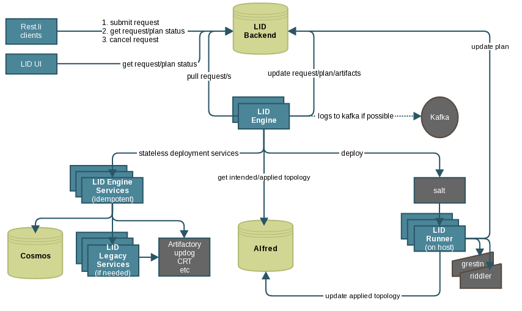
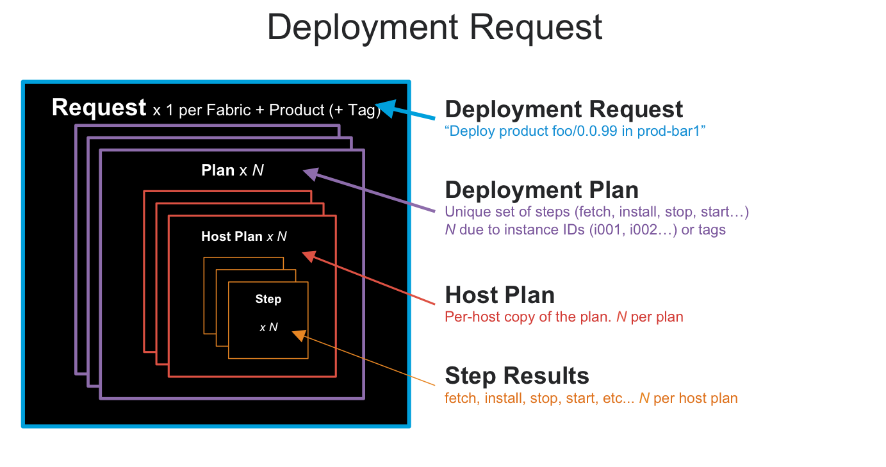
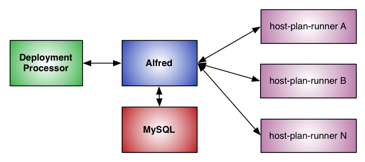
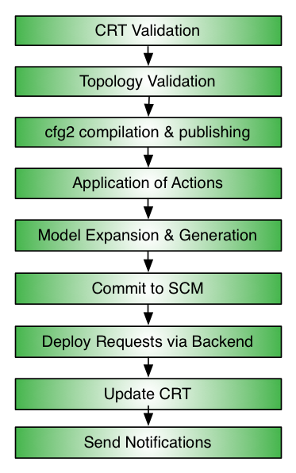

* TOC
{:toc}

# LID : LinkedIn Deployment

(go/lid)

LinkedIn Deployment (LID) is the toolset that enables deployment for Desktop development, PCx, and production deployments across all our fabrics.

## Deployment Components

### Alfred

- **What is it?** Alfred is the front-end to the source of truth for topology at LinkedIn. Alfred uses MySQL as it's back-end storage for keeping track of Application Instances, Topology data, and Deployment Plans.
- **How is it used?** Many systems, including the lipy-Fabric MP, LID UI, app-status and more use Alfred as their source of truth. See the Alfred page for further information.

### Porter

- **What is it?** The source of truth for TCP and UDP port assignments. See Port Registry aka Porter.
- **How is it used?** End users create Porter entries with the "porter" command line tool. The deployment system uses the port to validate that Application is up and responding to health checks.

### Rain

- **What is it?** Resource Allocation at LinkedIn (Automated Hardware Allocation) is a resource allocation engine.
- **How is it used?** The Rain server operates on Application Slices to spin up Application Instances on hardware in LinkedIn's data centers.

### Riddler

- **What is it?** Riddler handles the encryption and decryption of sensitive Config2 values. Currently it also generates PKI certificates, although that is moving to the "Grestin" application.
- **How is it used?** Via the "riddler" command line for encryption, and transparently during deployment to decrypt configs.

### Topology

Defines which Applications are deployed on physical hosts. This is recorded as a catalog of Application Instances and relevant metadata, stored in Alfred.

- **Intended Topology**: The definition and layout of your Application before it has been deployed.
- **Applied Topology**: The metadata taken from the Intended Topology after it has been applied and deployed on real hosts.

## lid engine architecture and overview

### [current architecture](https://iwww.corp.linkedin.com/wiki/cf/display/TOOLS/LID+Engine)



- **CRT UI**: Where to submit deployment requests. Overview of which versions are live in which fabrics. Quick view results of canary, EKG, tests. **go/crt**
- **LID UI**: Where to see granular results of your deployment requests. **go/lidui**

## deployment request data model



## Debug deployment

### Figure out current state

- **app-status**: currently installed versions?
- **go/crt**: workflow stages in correct state?
- **go/lidui**: what happened with previous deployment?

### Recover from deployment issues

- **c-d cancel**: start stopping the train
- **c-d --converge**: Target inconsistent hosts (works with canary!)

### Status after stopping deployment: triage time

- Overall Request: go/lidui - Deployment Request summary (See: Request log)
- Host Plan Step: go/lidui - Expand failed step (See: host-plan-runner.log)
- App Startup: go/lidui - Expand failed “start” step (See: Application log)

## Future

- control-deployment ☞ lid-client
- deployment-processor ☞ lid-server
- host-plan-runner ☞ lid-runner

---

# [Topology](https://iwww.corp.linkedin.com/wiki/cf/display/TOOLS/Topology+v3+User+Guide)

Topology is the specification of Applications, Instances, Tags and optionally Hosts for a Product (MP) that allows the deployment system to know what to deploy and to where.

Topology data is initially populated using "*mint product create*", or later using "*mint product edit*", as shown below.

## mint deploy related

 "*mint deploy*" and "*mint undeploy*" commands are driven off of Topology data, which must exist in your product-spec.json file.

You must add your Application to [Port Registry aka Porter](https://iwww.corp.linkedin.com/wiki/cf/display/TOOLS/Port+Registry+aka+Porter) before you can use "mint deploy".

## The Topology is composed of 3 models

`Topology starts its lifecycle as part of the product-spec.json for a given deployable product at LinkedIn.` When you create a new product, you will be prompted to add Topology information.

### Product Spec

* Application Name(s)
* Payload Name(s)
* Payload Context Path, if any.
* Application Kind:
  * jetty: An application that uses Jetty servlet container.
  * tomcat: An application that uses Tomcat servlet container.
  * generic: An application that doesn't have any container but contains a "bin/control" script to control the lifecycle of the war for the application. See Deploying Generic Apps
  * data-pack: A data pack. See LID Data Packs
  * azkaban: An Azkaban job. See: Azkaban FAQ
  * samza: A Samza stream processor. See: Samza
* Application Artifact: Ivy coordinate to the J2EE Container, Azkaban or Samza skeletons. This is chosen automatically during "mint product create".
* Optional metadata

### Application Slice

A “slice” serves as a template for your service, allowing you to specify a target service, instance identifier, resources needed per instance (via control groups) and any required product or config tags.

### Application Instance

Each deployment of your application slice is an “instance”.

We recommend using **Rain** to create and manage your Application Slice and Application Instance objects.

The Applied Topology also shows the instance health when using **app-status**.

## Intended Topology

`“What” and “where” to deploy`

Together these 3 models create the **Intended Topology, which describes where each application is deployed and what specifications the application was deployed with.**

The Intended Topology can be queried using **app-status** or programmatically with the **lipy-fabric** library with the IntendedApplicationInstance class. The instance data is updated during deployment and the version and Ivy coordinates returned are those used in the last deployment.


## Applied Topology

The Applied Topology is similar to the Intended Topology except that it represents the live state of the Topology. The Applied Topology may differ when a deployment fails to reach an instance.

```
{topology-v3|rain} slice create ...
{topology-v3|rain} instance create ...
echo “done”
```

---

# [Alfred](https://iwww.corp.linkedin.com/wiki/cf/display/TOOLS/Alfred)

## What is Alfred

Alfred is a LID component **storing** **DeploymentRequests** and **DeploymentPlans**. It's a Python Flask application, with multiple instances per Fabric.

It is a HTTP/REST server that acts as an **intermediary between the Deployment Processor and the Deployment Host Plan Runner**



## What does Alfred do

* The server **accepts** a JSON *DeploymentPlan* which is **saved** to a MySQL database. Then *Deployment Host Plan Runner* on each target host for a given Deployment retrieves the HostPlan, and updates Alfred with progress & status of the plan.
* The *Deployment Processor* periodically **polls** Alfred for completion of the plan, and gathers the progress & status data for the user.
* Additionally, Alfred **provides** *DeploymentRequest* & *Applied Deployment* information via its JSON **API**.

---

# [control-deployment](https://iwww.corp.linkedin.com/wiki/cf/display/TOOLS/Using+control-deployment)

control-deployment is a tool that combines many deployment-related processes into a single command, acting as the frontend for deploying applications and content. It interfaces with LID, Change Request Tracker (CRT), the Fabric API, subversion, cfg2, make-deployment, canary-ekg, inFormed, and others.

The purpose is to eliminate the need for manual editing of files, bring consistency to the deployment process, and eventually to speed up the entire deployment process by batching changes.

## [lid-client](https://iwww.corp.linkedin.com/wiki/cf/display/TOOLS/lid-client)

lid-client will replace control-deployment. It is more concise, supports parallel deployment for multiple fabrics, and much less verbose.

---

# [Deployment Processor](https://iwww.corp.linkedin.com/wiki/cf/display/TOOLS/Deployment+Processor)

Deployment Processor is the **heart of deployment** as **it manages the deployment lifecycle of a request**.

The deployment-processor
* **listens for DeploymentRequests** from CRT & control-deployment,
* **performs validation**,
* **manages the remote deployment** of your artifacts.

## Processing Pipeline

Once a *DeploymentRequest* has reached the *ControlDeploymentManager* pipeline, the following methods are applied.



A *DeploymentRequest* can be failed at any point during this pipeline, and will be reported at the end once all other requests have completed.

## Debugging

Logs for the deployment-processor are kept on the Deployment Hosts, in `/export/content/lid/logs/deployment-processor/i001/deployment-processor-<FABRIC>.log`, and they are rotated nightly.
Additionally, "session" data for each DeploymentRequest is kept in: `/export/content/lid/logs/deployment-processor/i001/sessions/<FABRIC>/<application>/<deployment-request-uuid>.json`

## lid-server

---
# [Deployment Host Plan Runner](https://iwww.corp.linkedin.com/wiki/cf/display/TOOLS/Deployment+Host+Plan+Runner)

* The host-plan-runner takes a *HostPlan* from *Alfred* and **executes the steps**, **reporting progress & status** back to *Alfred*.
* It is launched using *Salt* via the *DeploymentProcessor* for a given Fabric.
* Additionally, it will communicate with the *Riddler* to **decrypt** *cfg2* data files.


## Development

Host runner is part of the deployment-tools Python MP. See `go/mppy` for more dev info.
~~~
mint checkout deployment-tools
~~~

## lid-runner

---

# [Cosmos](https://iwww.corp.linkedin.com/wiki/cf/display/TOOLS/Cosmos%3A+Global+Topology+Backend#Cosmos:GlobalTopologyBackend-ApplicationSlicesAPI)

Global Topology Backend

Cosmos is a Python RestLi server that stores and exposes a number of resources related to the deployment system. It is part of the LID system.

This service is distinct from *Alfred* in that the resources exposed here are globally applicable instead of relating to a specific data center or fabric.

---

# [porter](https://iwww.corp.linkedin.com/wiki/cf/display/TOOLS/Port+Registry+aka+Porter)

keep track of the TCP & UDP ports used by services in Production & Pre-Prod fabrics.

Ideally, each port is unique globally inside of LinkedIn, however that may not always be the case, especially as we acquire companies who have their own port usage.

~~~
# Checkout the registry
porter checkout

# Add a new healthcheck port (not committed yet). This will automatically pick the next available port.
porter add --name app-name --protocol http --use "all things foo"

# Modify an existing port (not committed yet)
porter modify 10100 -n baz-tomcat -u "all things baz / remove healthcheck designation" --no-healthcheck

# List ports
porter list
porter list alfred

# Delete a port
porter delete 10100

# Check in your changes
porter commit
~~~

# salt

Execution, orchestration, and configuration management engine for infrastructure at scale


## [rain](https://iwww.corp.linkedin.com/wiki/cf/display/TOOLS/Rain)


## [app-status](https://iwww.corp.linkedin.com/wiki/cf/display/TOOLS/app-status)

CLI tool which shows currently deployed versions and health of apps

## app-status vs rain


## [range](https://iwww.corp.linkedin.com/wiki/cf/display/SOP/Introduction+to+Range)


# Terminology

## Product (aka MP)

A unit of deployment. Logically ties together Applications. See Multi Product for more information.

## Application Context

A URI path that is used by load balancers and the deployment system itself for a health-checks.

## Application

A unit of that is deployed as part of a Product. Applications have metadata associated with them, such as a TCP port, type (jetty, generic, data-pack), and encapsulate one or more payloads.

## Fabric

A logical grouping of hosts, currently in the same data center. Current names include "EI1" (Early Integration 1), "prod-lva1" (Production, Virginia Data Center).
The "dev" Fabric exists in our tooling, but today only represents the Desktop Deployment use case.

## Fabric Group

A Fabric group is a logical grouping of Fabrics. Currently defined as:

- **corp** (production environments for some applications, such as Kafka), Fabric names are prefixed with CORP-*
- **ei** (staging environments aka pre-prod) - EI1 (Atlanta EAT1 colo), EI2 (Atlanta EAT1 colo), EI3 (Virginia LVA1 colo)
- **prod** (production environments) - PROD-ELA4 (Los Angeles ELA4 colo), prod-lva1 (Virginia LVA1 colo), prod-ltx1 (Texas LTX1 colo)

## Instance

Not to be confused with Application Instance, an Instance is identified by a string like "i001" and maps to an location on disk where the Application is to be installed. An Instance has 0 or more ports globally reserved in Porter.

## Application Slice

A slice of an Application that can be scaled in or out.

An Application Slice represents an Application combined with its **runtime dependencies**. This includes what **host operating system** to run the Application on, how much **CPU and memory** is required, the **Config2 configuration** to apply (Config Tag).

Using Rain a Slice can be stamped across any number of hosts to create Application Instances. The Slice itself is **immutable**, but Slices can be forked in order to create new slices based off of the old.

The term Application Slice comes from the fact that the deployment of Applications at LinkedIn can be sliced up into different groups of Application Instances. In general, applications are divided up by instance ID (i001, i002 and so on). However, quite often applications are also divided by tags and deployed using a tag specifier. **Application Slice is abstraction that represents this division of an Application into pieces.** Many Application have only one slice but more complicated applications might be made up of multiple slices. One example is seas-indexer which is made up of several instance ids (i001, i002, etc) and can further be divided by some number of tags (experimental-cluster, etc).

## Application Instance

An installation of an Application running on a particular host. **Each Application Instance belongs to an Application Slice** and all of the Instances of a Slice are assumed to be identical in function and purpose.

Take for example the application noop-app. It might be divided (or sliced) into multiple groups:

- Slice 1: Has no tags and as default simply sits on a host not doing anything.
- Slice 2: Has a Config Tag "chew-cpu". This tag is associated with a configuration file that tells the code in "noop-app" to spin in an endless loop.
- Slice 3: Has a Config Tag "hog-memory". This tag is associated with a configuration file that causes the code in "noop-app" to consume memory until it is killed.

Each one of these slices can have 0 or more instances in any particular Fabric.

## Product Tag (ASP)

A special tag that allows for a different version of a product to be deployed to the same fabric. For most products, this is not used.

An example would be having a 'staging' and 'production' tag for a product, so that each of them would have a different version deployed to the same fabric. Another example is a product could have different clusters that may need to have different versions installed per cluster.

## Config Tag

A tag that is associated to a cfg2 configuration source. During deployment, the config source with the same name will be compiled and used for any instances that has the config tag.

## Canary

The deployment process to deploy a new version of a product to a small subset of application instances in order to verify / test the new version before promoting the same version to all other instances.

It is divided into the following phases:
- Deploying the canary instances with a new product version
- Once canaried, other systems (such as Test Manager, EKG, or other performance / testing systems that the product owner has setup) may start and provide feedback to CRT.
- If everything looks good, then the exact canaried versions (product version and config revisions) can be promoted to the rest of the instances.

This process is generally used in production, however canary can be done in any fabric.

---

# Useful links
* [lid home page](go/lid)
* [How Deplomnets Work](https://iwww.corp.linkedin.com/wiki/cf/display/TOOLS/How+Deployments+Work)
* [Deployment and Topology Terminology](https://iwww.corp.linkedin.com/wiki/cf/display/TOOLS/Deployment+and+Topology+Terminology)
