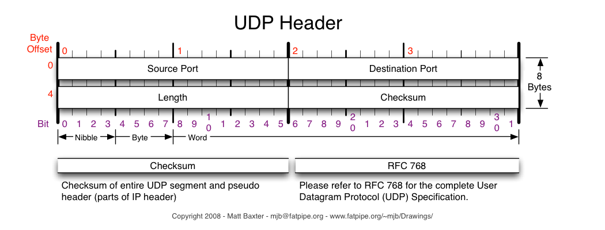

* TOC
{:toc}

# Chapter 0 - Resume, Interview and Offer

“一些面试的小技巧：一定要先沟通，明确自己了解题意”

“如果五分钟没有思路，可以向面试官求助。适当的提示并不会影响你最终的结果。”

“写完以后自己检查下有没有明显的错误，可以列举几个简单的测试数据，与面试官一起检验一下整个运行过程”

“面试是一个合作解决问题的过程，沟通一定是面试的关键：需要通过沟通展示你的逻辑性，理解能力和表达能力。”

“面试提问环节，可以问的问题包括：团队平时使用什么样的技术，通常的工作压力和工作时间，公司最让人兴奋的地方，在当前职位工作了多少年，面试官之前的工作经历与现在相比有什么异同等等”

“与老板沟通需要表现出你对他们团队的热情，并且在回答中尽量体现自己为什么适合这个职位。”

“通过与老板的面试，你需要了解这些问题：团队的成员构成，一般情况下项目如何分配，老板对你的期望，老板对团队在公司中发展的一些展望等等”

“准备一些常见的行为问题：比如你有没有过失败的经历，如果你老板给你不喜欢的任务怎么办，你想像中成为什么样的人。这里一方面可以结合自身精力，另一方面多关注公司的介绍页面，包括公司创始人背景，企业文化，招聘的要求。”

“如果你在总结题目的时候能够找到这些题目的模板，你把模板提炼好，碰到类似的题目，可以一边写模板，一边想想怎么在模板上做一点简单的改动。这样节省时间又保证不会出错。”

“你可以反复和面试官交流自己的想法，得到面试官认可以后再动手写”

“可以讲讲你怎样想到这个思路的。从而展现你的沟通能力。记住，你并不是要说服他接受你的想法，而是要把你的想法解释给他听”

“衡量一个程序员能力的标准，并不是他能想出多牛的算法(靠，那为什么还要面算法题？)而是当遇到问题的时候，程序员去分析和解决问题的能力。而出BUG的时候，正是展现你是否是一个合格程序员的时候！”

---

## 问题：什么时候才知道准备好面试？

算法是否过关，是否能写出递归和动规
Coding是否过关，是否能在编译器中写出Bug Free
Design是否过关，是否能给出Tradeoff
项目经历整理，能够流利说出架构，难点，自己的贡献
加分项:Github, Blog, 参与Open source

---

## 技术面试的流程模版：

当你拿到一个具体问题时，可以按照如下流程回答：
1. 明确题意：通过与面试官交流明确需要解答的问题。这部分主要为了让自己放松心态，并且给面试官留下你具有良好团队意识和交流能力的印象。

2. 描述大体思路：描述你打算用什么算法，什么数据结构。主要是为了让面试官了解你的思维过程，如果你给出的解答与他想要的答案偏差太多，可以及时纠正。同时，描述思路也给了你自己思考的机会。

3. 实现算法：先处理边界条件。对于重要的算法模块，加一些注释或者与面试官进行交流。目的是让面试官始终了解你在做什么，算法框架是什么。

4. 跑一个test：用一个test case走一遍你写的程序。目的在于和面试官一起确保你的算法是有效的，可以在过程中及时发现并纠正自己的错误。同时，给面试官留下你有写unit test习惯的良好印象。

5. 描述算法复杂度，回答面试官的问题。

---

## DEBUG流程：

1. 通过TEST CASE定位BUG所在位置
2. 不要立即修改代码，重新梳理逻辑。因为很有可能还有其他BUG。
3. 走完所有逻辑之后，心里有数怎么改了，再动手开始改
4. 用TEST CASE再走一次新的代码。
5. 在整个过程中，不停的告诉面试官你在干嘛(在不影响正常写程序的情况下)
这样，成功排解BUG，不但不会减分，还会因为你优秀的DEBUG能力和与此同时展现出来的沟通能力而加分。

---

---

# Chapter 1 - Array and String

“数组可以通过下标随机访问元素，所以在修改，读取某个元素的时候效率很高，具有O(1)的时间复杂度。在插入，删除的时候需要移动后面的元素，所以平均时间复杂度O(n)”

“当遇到某些题目需要统计一个元素集中元素出现的次数，应该直觉反应使用Hash Table”

“当处理当前节点需要依赖于之前的部分结果时，可以考虑使用hash table记录之前的处理结果。其本质类似于Dynamic Programming，利用hash table以O(1)的时间复杂度利用之前的结果”

“Rabin-Karp算法：将每一个匹配子串映射为一个hash值。例如，将子串看做一个多进制数，比较它的值与母串中相同长度子串的hash值，如果相同，再细致地按字符确认字符串是否确实相同。顺序计算母串hash值的过程中，使用增量计算的方法：扣除最高位的hash值，增加最低位的hash值。因此能在平均情况下做到O(m+n)。”

---

---


# Chapter 2 - Linked Lists

“链表的优势在于能够以较高的效率在任意位置插入或删除一个节点”

“只要涉及操作head节点，不妨创建dummy node”

“对于寻找list某个特定位置的问题，不妨用两个指针变量runner与chaser”

“遇到同时处理两个linked list的问题，循环的条件一般可以用 while( list1 && list2 ) ，当循环跳出后，再处理剩下非空的list。这相当于：边界情况特殊处理，常规情况常规处理。”

---

## Swap Node 问题

如果需要交换两个节点的位置，则对这两个节点的前驱节点，它们的next指针会受到影响；这两个节点本身的next指针，也会受到影响。但是，如下过程总是可以实现交换：
a. 先交换两个前驱节点的next指针的值；
b. 再交换这两个节点的next指针的值。

无论这两个节点的相对位置和绝对位置如何，以上的处理方式总是成立。

---

## 倒序处理

如果对靠前节点的处理必须在靠后节点之后，即类似于倒序访问的问题，可以用递归(recursion)，或者等效地，用stack来解决。 ”

---

---

# Chapter 3 - Stacks and Queues


## “Save for later”问题

有一类问题有这样的特性：当前节点的解依赖后驱节点。也就是说，对于某个当前节点，如果不能获知后驱节点，就无法得到有意义的解。这类问题可以通过stack(或等同于stack的若干个临时变量)解决：先将当前节点入栈，然后看其后继节点的值，直到其依赖的所有节点都完备时，再从栈中弹出该节点求解。某些时候，甚至需要反复这个过程：将当前节点的计算结果再次入栈，直到其依赖的后继节点完备。”

---

## 用stack解决Top-Down结构的问题

所谓的Top-Down结构，从逻辑理解的角度来看，实际上就是一种树形结构，从顶层出发，逐渐向下扩散，例如二叉树的周游问题。”

“在使用Stack的时候， 每个子问题应当被看成是同样类型的object，将该object按照Top-down的方向入栈。”

---

“在面试中，比较普遍的一个技巧是从最基本的case出发，根据题意推倒整个计算流程。这样做的好处是：
1) 确保自己正确地理解了题目
2) 从简单的情况出发，找找解题思路。
该方法特别适用于递归，动态规划等题目类型。”

---

---


# Chapter 4 - Trees and Graphs

## Concepts

“**高度的概念**：对一棵树而言，从根节点到某个节点的路径长度称为该节点的层数(level)，根节点为第0层，非根节点的层数是其父节点的层数加1。*树的高度定义为该树中层数最大的叶节点的层数加1，即相当于于从根节点到叶节点的最长路径加1。*”

“**平衡二叉树**，是指一棵树的左右两个子树的高度差的绝对值不超过1，并且左右两个子树都是一棵平衡二叉树。”

“**满二叉树(full binary tree)**：如果一棵二叉树的任何结点，或者是叶节点，或者左右子树都存在，则这棵二叉树称作满二叉树。”
A full binary tree (sometimes proper binary tree or 2-tree) is a tree in which every node other than the leaves has two children.

“**完全二叉树(complete binary tree)**：如果一棵二叉树最多只有最下面的一层节点度数可以小于2，并且最下面一层的节点都集中在该层最左边的连续位置上，则此二叉树称作完全二叉树。”
A complete binary tree is a binary tree in which every level, except possibly the last, is completely filled, and all nodes are as far left as possible

“**字典树(trie or prefix tree)**是一个26叉树，用于在一个集合中检索一个字符串，或者字符串前缀。字典树的每个节点有一个指针数组代表其所有子树，其本质上是一个hash table，因为子树所在的位置(index)本身，就代表了节点对应的字母。节点与每个兄弟具有相同的前缀，这就是trie也被称为prefix tree的原因。”

“通常所说的堆(Heap)是指二叉堆，从结构上说是完全二叉树，从实现上说一般用数组。”

“堆最重要的性质是，它满足partial order：最大(小)堆的父节点一定大于等于(小于等于)当前节点，且堆顶元素一定是当前所有元素的最大(小)值。”

“如果题目有一个起始点，一个终止点，可以考虑看成图的最短路径问题”

---

## 单源最短路径问题 (SSSP：Single-Source Shortest Path)

“Bellman-Ford和Dijkstra算法。前者适用于一般情况(包括存在负权值的情况，但不存在从源点可达的负权值回路)，后者仅适用于均为非负权值边的情况。Dijkstra的运行时间可以小于Bellman-Ford。”

“特别地，如果每条边权值相同(无权图)，由于从源开始访问图遇到节点的最小深度就等于到该节点的最短路径，因此 Priority Queue就退化成Queue，Dijkstra算法就退化成BFS”

“Dijkstra的核心在于，构造一个节点集合S，对于S中的每一个节点，源点到该节点的最短距离已经确定。进一步地，对于不在S中的节点，我们总是选择其中到源点最近的节点，将它加入S，并且更新其邻近节点到源点的距离。算法实现时需要依赖优先队列。一句话总结，Dijkstra算法利用贪心的思想，在剩下的节点中选取离源点最近的那个加入集合，并且更新其邻近节点到源点的距离，直至所有节点都被加入集合。”

The implementation of Dijkstra based on a min-priority queue implemented by a Fibonacci heap is running in O(|E| + |V| * log|V|) (where |E| is the number of edges). This is asymptotically the fastest known single-source shortest-path algorithm for arbitrary directed graphs with unbounded non-negative weights.

```
DIJKSTRA(G, s)
S = EMPTY
Insert all vertexes into Q
While Q is not empty
    u = Q.top
    S.insert(u)
    For each v is the neighbor of u
        If d[v] > d[u] + weight(u, v)
            d[v] = d[u] + weight(u, v)
            parent[v] = u”
```

---

## All-pairs shortest paths

另一个关于图常见的算法是，如何获得任意两点之间的最短距离。直观的想法是，可以对于每个节点运行Dijkstra算法，该方法可行，但更适合的算法是Floyd-Warshall算法。
Floyd算法的核心是动态规划，利用二维矩阵储存i，j之间的最短距离，矩阵的初始值为i，j之间的权值，如果i，j不直接相连，则值为正无穷。
动态规划的递归式为：$d^{(k)}_{ij} = min(d^{(k-1)}_{ij}, d^{(k-1)}_{ik}+ d^{(k-1)}_{kj})  (1<= k <= n)$。
直观上理解，对于第k次更新，我们比较从i到j只经过节点编号小于k的中间节点(d(k-1)ij)，和从i到k，从k到j的距离之和 $(d^{(k-1)}_{ik}+ d^{(k-1)}_{kj})$。
Floyd算法的复杂度是O(n^3)。

```
FLOYD(G)
Distance(0) = Weight(G)
For k = 1 to n
    For i = 1 to n
        For j = 1 to n
			Distance^(k)_ij = min(Distance^(k-1)_ij, Distance^(k-1)_ik+ Distance^(k-1)_kj)  
Return Distance(n)
```

---

## 利用Divide and Conquer(D&C)策略判断树、图的性质

“对于树和图的性质，一般全局解依赖于局部解。通常可以用DFS来判断子问题的解，然后综合得到当前的全局结论。**值得注意的是，当我们在传递节点指针的时候，其实其代表的不只是这个节点本身，而是指对整个子树、子图进行操作**。”

“在构造递归的时候，不妨将递归调用自身的部分视为黑盒，并想象它能够完整解决子问题。”

---

## 将Tree和其他数据结构的相互转换

这类题目要求将树的结构转化成其他数据结构，例如linked list, array等，或者反之，从array等结构构成一棵树。前者通常是通过树的周游，合并局部解来得到全局解，而后者则可以利用D&C的策略，递归将数据结构的两部分分别转换成子树，再合并”


---

---

# Chapter 5 - Bit Manipulation

## Basic bit manipulations

最基本的操作包括Get bit, Set bit和Clear bit。

**Get bit**: (num >>> n) & 1
**Set bit to 1**: num | (1 << n)
**Set bit to 0**: num & ~(1 << n)  (Clear bit)
**Remove the lowest 1**: num & (num - 1)
**Remove all the bits except the lowest  1**:   num & ~(num-1),

## Construct a bit mask

“我们要构造一个第i到第j位为0，其它位为1的bit mask，则可以对~0进行左移操作获得形如111…0000的mask，再对~0进行右移操作，获得形如000…111的mask，最后通过位或(此处相当于相加)得到最终的bit mask。”

“对于需要进行比特操作的题目，对题目要求进行分步，然后选择合适的bit mask，最后与给定二进制数进行基本位操作都是解题的关键。”

---

---


# Chapter 6 - System Design & Object Oriented Design

设计题可以分成两个类别：系统架构设计和利用面向对象编程原理进行程序设计。前者所涉及的技术往往包括数据库，并发处理和分布式系统等等，对于经验要求和知识要求比较高。

---

## 系统设计的面试流程:

**1. 题目描述**
往往非常简单，如：设计一个XX系统。 或者：你有没有用过XXX，给你看一下它的界面和功能，你来设计一个。
**2. 阐述题意**
面试者需向面试官询问系统的具体要求。如，需要什么功能，需要承受的流量大小，是否需要考虑可靠性，容错性等等。
**3. 面试者提供一个初步的系统设计**
**4. 面试官这对初步的系统中提出一些Follow-Up的问题**：如果要加某个功能怎么办，如果流量大了怎么办，如何考虑Consistent怎么办，如果机器挂了怎么办。
**5. 面试者根据面试官的Follow Up逐个解决问题**
**6. 完成面试**

>总体特点是以交流为主，画图和代码为辅”

---

## 考量标准

- Adapt to the changing requirements (适应变化的需求)
- Produce a system that is clean, elegant, well thought (设计干净，优美，考虑周到的系统)
- Explain why you choose this implementation (解释为何这么实现)
- Be familiar with your experience level to make decisions (对自己的能力水平很熟练)
- Answer in high level of scale and complexity (在一些高层结构和复杂性方面有设计)

按照评分体系的化，分成下面4个等级

| Scoring |  Criteria   |
| :-------: |:------ |
| 1.0 Bad | No sense of requirement, no scoping |
| 2.0 Poor | Limited knowledge, common sense |
| 3.0 Good | Reasonable Solution, explain clearly |
| 4.0 Great | Out of expectation, well thoughtful, tradeoff |

其实大家大可不必追求完美，在真正的面试中，没有人能对答如流，往往面试官也会给出善意的提示，就算你没回答某个子问题，在面试后的评价中也会综合衡量，跟其他的面试者比较，最终打出一个分数。我认为很多人在2到3分左右，当然我们目标是尽量在3分以上。

---

## To be continued

---

---

# Chapter 7 - Recursion and Dynamic Programming

“递归(recursion)和动态规划(Dynamic Programming, DP)能解决的问题都有一个特性：原问题(problem)可以分解成若干个子问题(sub-problem)，只有先解决了子问题才能进一步解决原问题。子问题的解决方式形式上与原问题一致”

“从题目描述来看，可以提示我们尝试用递归、DP解决的关键词有：compute n-th element (value, sum, max, etc.), return all the paths, return all the combinations, return all the solutions…”

“从解决问题的角度来说，用Bottom-Up的DP，固然通常可以节省递归本身的空间开销，但有很多**缺点和局限**：较难理解，边界条件较难处理，**只适用于问题的节点空间是离散的整数空间，必须一步步邻接、连续地计算**(无论是不是每一个节点的结果都会被用到)。
**而Memoization，则灵活得多**：可以从递归形式轻易修改得到，也更符合普遍的思维过程，并且没有上面说的这些局限，子问题只有在被需要的时候才会被计算。尤其是在某些情况下，不仅需要aggregate的结果，还需要获得achieve这个结果的路径，这时候就算用Bottom-Up的DP，也需要记录prev节点，最后需要递归回溯得到路径，那么节省递归空间开销的优势，也荡然无存了”

“**Greedy Algorithm**：只做出当下最优的判断，并且以此为基础进行下一步计算。当前判断最优时，不考虑对全局/未来的影响，所以从全局来说并不能保证总是最优。贪心算法每次更新当前的最优解 。如Dijkstra算法就是贪心算法的实例之一。”

---

## 用Dynamic Programming (Bottom-Up) 解决收敛结构问题

具有强收敛性/Aggregate属性的问题(承前所述，是指关于特解，或最值，或总和，或数量的问题)，都可以用整数坐标映射所有节点，且当前节点的解只依赖于前驱节点(无论是顺序还是倒序)。那么，这类问题往往可以用DP解决。解决的关键是建立subproblem的解之间的递推关系：
`f(n) = G[f(n-1), f(n-2), … , f(1)] 或  f(i, j) = G[f(i-1, j-1), f(i, j -1), f(i-1,j)]`
其中G[ ]表示子问题到原问题的映射关系，例如对于斐波那契数列，有递推式：
`f(n) = G[f(n-1), f(n-2)] = f(n-1) + f(n-2)`

---

“如果问题除了要计算动归终点的数值以外，还需要记录具体的到达路径，则可记录每个节点的前驱节点(prev[n])或前驱路径(vector<vector<int> > prev)，然后用终点出发通过backtracking处理成path。”

“如果出现类似于“所有解”，“所有路径”等关键词，则用Top-down方法更为直接。”

“寻求一个特解以满足一定的条件。对于这样的判定性问题，它具有很强的聚合性，可以用DP。”

“最小值问题，有很强的聚合性，用DP。”

对于“最长子序列”问题(即有限空间内，满足一定条件的最长顺序子序列)，本身具有很强的聚合性，可以以如下方式解答：用DP Table来记录以当前节点为末节点的序列的解(至少固定问题的一端)

“当前节点的解，既和左边的元素有关，又与右边的元素有关，两者相互独立，可以用双向DP。”

---

## 用Memoization Technique(Top-Down)解决收敛结构问题

Memoization是Top-Down形式的Dynamic Programming，并且受到的制约更少，自然也可以用来解决前述的问题(但空间上可能效率不及Bottom-Up形式的DP)。Memoization的核心在于，*在原有递归框架下，储存子问题的计算结果，在重复计算子问题时返回已经计算的值。*

---

## 用Backtracking( Top-Down )解决发散结构问题

“对于发散性问题(例如“所有组合”，“全部解”)，可以选取其问题空间“收敛”的一端作为起点，沿着节点发散的方向(或者说，当前节点的多种选择)进行递归，直到a.当前节点“不合法” 或 b.当前节点发散方向搜索完毕，才会return。”

“Backtracking的核心在于选择哪些方向/决策，才是最合理，不重复的。所谓“剪枝”(pruning)，就是指：只选择尽可能少的、可能到达“胜利条件”的方向，而不是搜索当前节点的所有发散方向。这样，可能将幂指数级的复杂度降低到阶乘级。”

Backtracking(回溯)本身隐含的含义是，在访问完这个节点返回时，需要恢复原本的状态(即回到该节点)，以访问其他路径。具体实现时，意味着需要:
1)在return前，删除path中的当前节点。
2)如果搜索的方向有出现环路的可能，那么可以使用bool []或hashmap来记录该节点是否已被使用，在访问时以及return前维护。

---

## 用Divide and Conquer 解决独立子问题

如果能将问题由几个孤立但类似的部分组成，则可以优先选择使用D&C策略：将问题分割解决，再合并结果。特别地，如果期望将问题的复杂度由O(n)进一步降低到O(logn)，一般总是可以联想到使用D&C策略，将问题分割而治。

---

---

# Chapter 8 - Sorting and Searching

“由于merge sort不依赖于随机读写，因此具有很强的普适性，适用于list等数据结构，并且处理list只需要O(1)空间。”

维护动态数据(data stream)的最大值、最小值或中位数，可以考虑使用**heap**。如果是动态数据求最大的k个元素，因为元素总数量不确定，不能使用quick select，这种情况下也应该用heap解决。

如果需要一个动态插入/删除的有序数据结构，那么可以使用**二叉搜索树**，因为它天生就是一个动态的有序数组，**并且支持检索**。

“在通常面试中，如果数据已经部分有序，我们理应能够实现时间复杂度优于O(nlogn)的算法。”

“需要一个动态的数据结构，**支持快速检索，并且满足一定的有序性**，这样才能维护这个特殊属性(给定值在这个有序结构中的相对位置)，**使用二叉搜索树**。”

“对于有序线性容器的搜索，二分查找或其变种基本上是解题的最佳方法”

## Quick sort VS Merge sort

* **Time**: Worst case O(n^2)  vs O(nlogn)
* **Space**: Quicksort needs constand space. Merge sort may need extra space(On arrays, merge sort requires O(n) space; on linked lists, merge sort requires constant space).
* **Stability**: Quick sort is not stable; Merge sort is stable.
* In practice, quick sort is a lot more faster (if data can be all load into memory), cache efficient.
* Quick sort needs random access; Merge sort is more general, can be applied to more data structures, can be paralleled easily.


## Scalability & Memory Limits 问题

对这类问题一般采用Divide & Conquer策略，即对问题进行预处理，将问题的输入进行分割、归类(sorting)，放入相应的Bucket(单机上的某一块Chunk，或者分布式系统中的一台单机)，再对每个Bucket进行后期处理，最后合并结果。
整个过程中应该用到hash function: 对于Memory Limits问题，一般可以直接利用hash function建立对象到索引的直接映射；对Scalability问题，一般可以用hash table来记录对象与储存该对象的机器之间的映射，在该机器上进一步做映射以获得索引。

### Look up books by key words

E.g. A library is trying to build up a smart computer-aided look up system: user may input a list of key words, and the system shall provide all books that contain these words. How to implement such query? (A library may have millions of books)

**解题分析**：对于文章中单词的检索，一般采用倒排索引(Inverted index) ，其本质就是单词到文档集合的一个hash。

当文档／单词量巨大时，如何实现scalability？
我们需要以一定的规律将hash table分配到多台机器上，即完成对hash table的拆分和分块储存。例如，machine1可以负责首字母为a的所有单词，machine2可以负责首字母为b的单词，以此类推。事实上，这个过程相当于引入另一层hash进行数据分流：建立对象与储存该对象的机器之间的映射。


### Look up connection between two users

E.g.Design a scalable social network system and support looking up connection between two users.

**解题分析**：与上题类似，首先我们考虑数据量不大的情况，即所用用户数据储存在同一部机器上。要查询两个用户之间的联系无非就是广度优先搜索。

进一步地，如果数据量很大，那么我们需要用多台机器储存对象。不妨采用与上题类似的思路：引入另一层hash进行数据分流，建立对象与储存该对象的机器之间的映射。通常用户都有一个唯一的ID，我们可以利用ID的前几位数字，决定将该用户数据存放在哪台机器上。这样，广度搜索的查询流程变为：
1. 获得用户的好友ID列表
2. 根据ID获得机器
3. 访问机器获得对应的用户节点”
4. 进行下一步递归

应用该方法我们需要注意一下问题：
1. 访问另一台机器的成本可能比较高，因此应该尽量把该机器上的所有相关数据一次性读取完毕。
2. 广度搜索需要记录某个节点是否已经访问过以避免循环访问，我们可以另外开辟一个hash table记录已经访问的用户节点。
3. 注意合理地简化问题：如果两个用户之间需要多于3重关系才能联系上，我们可以把他们归类为“陌生人”。那么，我们可以将关系链限制在3重关系以内，以减少搜索成本。”


### De-duplicate URLs

Suppose you are given an extremely large set of URLs, ~billion for example. How do you de-duplicate(remove duplicates)?

**解题分析**：对于本题，我们还是套用惯用的模版：
1. 先考虑小数据量的情况 使用hash table
2. 数据量很大 使用多台机器，引入另一层hash进行数据分流
   分流方式可以根据机器数量，采用URL的前若干个字符进行数据到机器号的映射。

---

---

# Chapter 9 - Testing

一般情况下，总是需要考虑以下几个方面，以全面测试对象对于不同类型输入的"效果"：
1. Normal cases
2. Extreme cases
3. Invalid cases

---

## Troubleshooting

另一大类的常见问题是给出一个有问题的测试现象，让面试者判断问题出现在哪里。
对于这类问题，首先考虑测试对象由生成，到运行，到产生最终结果的完整流程，其次判断每一步执行了什么，需要依赖哪些参数，该步骤的异常是否会导致最终的测试现象，并且考虑如何验证自己的判断。

>1. 列出流程，步骤
>2. 分析每步可能出错的原因有哪些
>3. 每个错误对应的现象是什么 (更难：如何排除每个错误)
>4. 根据现象分析哪步出错，如果错误无法明显找出，可以用控制变量法，固定其他变量，只改变一种变量，看测试结果，排除其他因素。 （Univariate analysis）


### E.g.1.Can not access to XXX.com

例如，测试用户无法访问你开发的网站。
首先考虑主要流程，简述如下：用户连接到网络，发送HTTP请求到网站，网站发送数据包给用户，用户浏览器显示页面。
在此例中，每一步都有可能导致无法访问网站的情况，具体描述如下：
(1) **用户连接到网络**：这一步用户需要获得有效的IP，获取访问互联网的权限。需要依赖用户的网卡是否工作正常，是否能够被分配到有效的IP，是否能够从路由器或者服务器获得互联网访问权限等等。
**检验方式可以是**：可以打开终端用ping命令，尝试建立与大型网站的连接。或者直接用浏览器尝试访问其他大型网站。如果不能建立与其他网站的连接，则网络接入有问题。

(2) **发送HTTP请求到网站**：用户首先会通过DNS获取服务器地址，然后发送HTTP请求到对应的IP。需要依赖用户能否正确获取网站IP地址。
**检验方式可以是**：在用户端利用抓包软件，例如WireShark，tcpdump等，观察是否有HTTP请求发送到网站服务器。如果没有发送HTTP请求或目的地IP有问题，则DNS可能有错。

(3) **网站发送数据包给用户**：这一步需要网站接收到HTTP请求，并且将对应数据传回给用户。需要依赖网站能否收到HTTP请求以及对于HTTP请求的处理是否正确。
**检验方式可以是**：在服务器端通过log判断是否有新用户接入，接入请求的处理是否正确，以及发送给用户的数据是什么。如果网站没有收到请求，则服务器端的网络可能有问题。如果服务器无法处理HTTP请求或抛出异常，则服务器的实现可能有问题。

(4) **用户浏览器显示页面**： 这一步需要用户接收到网站发回的数据，浏览器解析数据并显示页面。需要依赖于用户能否收到数据，以及收到的数据是否能够被浏览器正确解析及显示。
**检验方式可以是**：在用户端利用抓包软件，观察是否有来自服务器的数据。一般来说，如果用户用的是商用浏览器，即能够正确解析数据。故如果能收到服务器数据但是不能正常显示，我们可以认为服务器的数据有问题。


### E.g.2.Web browser crashes

 You implemented a mobile web browser, but it crashes sometimes when browsing. How to debug it?

**解题分析**：首先考虑主要流程，简述如下：用户打开应用，连接到网页，接收数据，用JavaScript及flash等插件解析网页，显示内容。由于并非每次浏览都会奔溃，因此可以假设打开应用，连接到网页，接收数据不是问题的关键。于是我们进一步考虑解析网页，显示内容这两步执行了什么，需要依赖哪些参数。

(1) 解析网页
这一步需要分析服务器端传入的HTML数据，并且调用JavaScript，Flash等插件显示网页的动态部分。该过程依赖于HTML解释器及各个插件是否工作正常，如果缺少插件并没有恰当地处理异常，可能导致应用奔溃。检验的方法是需要研究奔溃现象是否和访问的具体网页有关，如果每次访问某个网页都会奔溃，则需要利用其他浏览器进一步研究解析该网页的过程中调用到了哪些模块，然后采用排除法确定待测试浏览器的哪个模块出现了问题。

(2) 显示内容
浏览网页的最后一步是将数据，图片和动态元素显示在页面上。考虑到这是手机端的浏览器，移动平台本身的计算资源比较有限，因此，内存可能成为瓶颈，并导致应用奔溃。该情况较容易出现在同时打开多个页面的情况。检验的方式可以是：同时访问多个大型门户网站，观察是否会造成应用奔溃。解决方式可以是：仅将用户正在浏览的页面内容读入内存，其他页面缓存至硬盘。并且可以降低图片分辨率，以减少内存消耗。

---

---

# Chapter 10 - Networking

## Routing

Routing是指在Network Layer(OSI model的第三层)，将数据包(data packet)从一个节点以最优路径发送到目标节点的实现方法。
其核心包括：
- 如何获得邻近节点的信息，
- 如何估计链路质量，
- 如何寻址，
- 如何构建网络拓扑结构等等。

通过路由器之间的routing protocol，可以实现两个网络节点之间信息(包括网络域名，邻近节点，链路质量等)的交换和散布，通过不断重复该过程，每个节点都会获得足够多关于所在网络的拓扑信息。当有数据包需要传送时，路由器再通过routing algorithm计算传递当前数据包的最优路径，并把数据包发送给下一个邻近节点。许多routing algorithm基于图理论，实现了*最小生成树*，*最短路径*等等经典的拓扑算法。

直观而言，network routing的过程就相当于传统意义上的邮包寄送，IP地址可以类比于邮政编码，路由器就相当于邮局，通过目的地邮政编码与邮局系统中的递送路径进行比较，由此确定下一步应该把当前包裹传递到哪里。

## Transmission Control Protocol，TCP

**TCP Header**


**Reliable Protocol**
TCP是一种可靠的传输协议，即在网络条件正常的情况下，TCP协议能够保证接收端收到所有数据，并且接收到的数据顺序与发送端一致。**TCP通过在发送端给每个数据包分配单调递增的sequence number，以及在接受端发送ACK(acknowledgement)实现可靠传输**。每个发送的数据包都包含序列号，当接收端收到数据包时，会发送ACK告诉发送端当前自己期待的下一个序列号是多少。


To assure correctness a checksum field is included. The TCP checksum is a weak check by modern standards. Data Link Layers with high bit error rates may require additional link error correction/detection capabilities. The weak checksum is partially compensated for by the common use of a CRC or better integrity check at Data link layer, below both TCP and IP, such as is used in PPP or the Ethernet frame.

**Flow Control**
TCP使用了end-to-end flow control以**避免发送端发送数据过快导致接收端无法处理**。**TCP采用了滑动窗口(sliding window)实现流量控制**。接收端**通过ACK告诉发送端自己还能够接收多少数据**，发送端不能发送超过该值的数据量。当接收端返回的窗口大小为0时，发送端停止发送数据，直到窗口大小被更新。由于ACK是由发送端发送的数据触发，可能接收端窗口已经打开，但是由于发送端已经停止发送，故接收端没有机会通过ACK告知发送端新的窗口大小，在这种情况下会造成死锁。在实际实现中，发送端会设置一个timer，如果timer到期，发送端会尝试发送小数据包，以触发接收端的ACK。

**Congestion Control**
**为了控制传输速度防止堵塞网络**，并且在网络容量允许的范围内尽可能多地传输数据，TCP引入congestion control，用以判断当前的网络负荷，并且调整传输速率。For each connection, TCP maintains a congestion window, limiting the total number of unacknowledged packets that may be in transit end-to-end. This is somewhat analogous to TCP's sliding window used for flow control. TCP通常采用additive increase，multiplicative decrease的算法，即**如果 *按时* 收到对应的ACK，则下一次传输速率线性增加，否则则视为发生了网络堵塞，下一次传输的比特数折半**。所谓的“按时”基于RTT：发送端会估计RTT，并且期望当数据包发送以后，在RTT时间内收到对应的ACK。现代TCP需要分别实现Slow-start，congestion avoidance，fast retransmit和fast recovery，以达到最高的效率。

---

## User Datagram Protocol，UDP

相比于TCP，UDP简单许多：连接建立时不需要经过类似于TCP的三次握手，只需要知道接收端的IP和端口，发送端就可以直接发送数据。同时，UDP也没有ACK，flow control和congestion control，故UDP本身不能保证传输是可靠的。由于UDP本身只负责把数据传输到目的地，故可扩展性比较强。有些应用可以实现基于UDP 的特定算法，使得传输效率高于TCP。例如，当发生丢包时，TCP会重传该数据包，但该操作增加了传输延时。对于某些实时性要求较高的应用，可能继续传输新的数据更为重要，故基于UDP的传输方式可以更好地满足该要求。

**UDP Header**



---

## TCP vs UDP

| TCP | UDP |
| :------:| :------: |
| Reliable transmission | Unreliable |
| checksum --> ensure data integrity | also has checksum |
| Sequence number + ACK --> Ordered and complete data | Not guaranteed |
| Flow control mechanism (sliding window) | None |
| Congestion control mechanism | None |
| More overhead on header to ensure reliability | lightweight header, good for real time application |

通常而言，如果需要满足可靠性，有序接收，自适应带宽等要求，应该优先考虑TCP，因为其协议本身确保了这点。如果对实时性要求较高，或者应用需要特定的网络传输特性，则可以实现基于UDP的传输协议。往往，这样的协议需要实现congestion control，flow control，retransmission等机制，故通常情况下都可以直接采用TCP以减小开发成本。

---

## E.g.1 What happens after you typed a URL in your browser and pressed return key?

**解题分析**：如果要连到远程服务器，首先需要知道服务器的IP地址和端口。其次需要发送接入请求到服务器，服务器返回响应数据。因此，如何寻址和如何建立链接是本题的关键。本题属于知识性问题，没有太多的解题技巧，直接给出解答如下：

**参考解答**：
1. 进行寻址：**如果在浏览器缓存中存有URL的对应IP，则直接查询其IP**；否则，访问DNS(Domain Name System)进行寻址(Domain Name Resolution)。
2. DNS或者URL cache返回网页服务器的IP地址。
3. 浏览器与网页服务器通过三次握手建立TCP连接。由于是网页浏览服务，故浏览器连接到服务器的80端口。
4. 浏览器与服务器建立HTTP会话(session)，接收来自服务器的HTTP数据。
5. 浏览器解析HTTP数据，在本地窗口内渲染并显示网页。
6. 当浏览器页面被关闭时，终止HTTP会话并关闭链接。


## E.g.2 If you are designing a reliable UDP, what should you do?

**解题分析**：通常，所谓的reliable都是指接收端能够将收到的数据情况反馈给发送端。由于我们已经知道一种可靠的传输协议，TCP，故reliable UDP的设计完全可以参考TCP的设计方式，引入ACK，flow control，congestion control等模块。模块的实现可以直接模仿TCP，也可以通过和面试官的沟通进一步确定需求。**Reliable UDP的核心在于反馈机制**，这里给出几个可能的实现方式。

**参考解答**：
由于reliable要求在接收端能够恢复数据包的顺序，故发送端每个数据包都需要有sequence number。现在着重讨论反馈机制：
1. **最朴素的ACK方式**：发送端每发送一个数据包，都需要接收端返回ACK，一旦超时，发送端重新发送数据包，直到该数据包被接收端ACK。该方法效率不高，因为之后的所有数据包都被当前数据包block，并且每次返回ACK增加了overhead。
2. **Block/bit map ACK**：发送端发送一批数据包，例如32个，编号0～31。接收端发回的ACK中用32bits(4bytes)的bit map表示收到了哪些数据包，发送端再一次性重发所有未被收到的数据包。该方法能够更加充分地利用带宽，在发送端一次性传输更多的数据。但缺点是在发送端接收端都需要更深的buffer，暂存正在传输的所有数据。
3. **ACK last packet**：发送端可以在发送最后一个数据包时要求接收端反馈ACK，并重发丢失的数据包。这样做的好处可以减少由ACK造成的data overhead，但需要通过buffer暂存数据。

事实上，**可以结合方法2和方法3，在每一批数据包的最后一个置位request ACK flag，要求接收端返回bit map ACK。**更进一步地，可以根据丢包率及延迟，估计网络状况，动态地调整bit map的大小：在网络状况好的情况下，用更大的bit map，即同时发送更多数据。否则，减小发送数据量。事实上，这种对于网络状况的自适应也相当于实现了congestion control。


## E.g.3 For real-time video conference application, how do you choose between TCP and UDP?

**解题分析**：本题的关键在于比较TCP和UDP的特点，并且根据real-time video conference这个特定的应用场景进行选择。在前面提到过，**TCP的重传机制会增加延迟，所以不适用于当前场景**。其次，**视频音频编码本身可以容忍数据出错甚至数据丢失**。因此，并不需要采用TCP进行可靠的数据传输。当某一视频帧出现丢包时，可以直接跳过这一帧或者继续播放上一帧。再次，一旦出现网络堵塞的状况，发送端应该主动丢弃一部分数据。原因是，即使这些视频帧发送到了接收端，也可能已经“过期”了，不会被解码显示。采用自己设计的UDP更便于实现对数据包的控制。
然而，**即使使用UDP，也需要实现TCP的某些模块：比如需要flow control和congestion control来判断接收端的播放情况和网络情况，并且也需要反馈机制判断接收端的接收状况**。尽管对于当前场景我们不需要ACK每个数据包，但是接收端可以反馈当前收到的最新完整视频帧的序号。这样，如果一旦发生丢包，发送端可以以接收端收到的最新视频帧为基础，压缩后继的视频。

---

---

# Chapter - 11 Low Level

## Processes vs. Threads

进程与线程最大的区别是进程拥有自己的地址空间，某进程内的线程对于其他进程不可见，即进程A不能通过传地址的方式直接读写进程B的存储区域。进程之间的通信需要通过Inter-process communication (IPC)。与之相对的，同一进程的各线程间之间可以直接通过传递地址或全局变量的方式传递信息。

此外，进程作为操作系统中拥有资源和独立调度的基本单位，可以拥有多个线程。


**线程可以分为两类：**
1. 一类是用户级线程(user level thread)。对于这类线程，有关线程管理的所有工作都由应用程序完成，内核意识不到线程的存在。
**用户级线程的好处是非常高效，不需要进入内核空间，但并发效率不高。**

2. 另一类是内核级线程(kernel level thread)。对于这类线程，有关线程管理的所有工作由内核完成，应用程序没有进行线程管理的代码，只能调用内核线程的接口。内核维护进程及其内部的每个线程，调度也由内核基于线程架构完成。
**内核级线程的好处是，内核可以将不同线程更好地分配到不同的CPU，以实现真正的并行计算。**

在现代操作系统中，往往使用组合方式实现多线程，即线程创建完全在用户空间中完成，并且一个应用程序中的多个用户级线程被映射到一些内核级线程上，相当于是一种折中方案。

### Comparison

Threads differ from traditional multitasking operating system processes in that:
* **Overall**: A process, in the simplest terms, is an executing program. One or more threads run in the context of the process. A thread is the basic unit to which the operating system allocates processor time. A thread can execute any part of the process code, including parts currently being executed by another thread.
* **Dependency**: processes are typically independent, while threads exist as subsets of a process
* **Resources**: processes carry considerably more state information than threads, whereas multiple threads within a process share process state as well as memory and other resources
* **Address space**: processes have separate address spaces, whereas threads share their address space
* **Communication**: processes interact only through system-provided inter-process communication mechanisms
* **Context switch**: context switching between threads in the same process is typically faster than context switching between processes.

Systems such as Windows NT and OS/2 are said to have "cheap" threads and "expensive" processes; in other operating systems there is not so great a difference except the cost of an address space switch which on some architectures (notably x86) results in a translation look aside buffer (TLB) flush.


## Context Switch

对于单核单线程CPU而言，在某一时刻只能执行一条CPU指令。上下文切换是一种将CPU资源从一个进程分配给另一个进程的机制。从用户角度看，计算机能够并行运行多个进程，这恰恰是操作系统通过快速上下文切换造成的结果。在切换的过程中，操作系统需要先储存当前进程的状态(包括内存空间的指针，当前执行完的指令等等)，再读入下一个进程的状态，然后执行此进程。

## Semephore/Mutex

对于semaphore而言，在初始化变量的时候可以控制允许多少个线程／进程同时访问一个critical section，其他的线程／进程会被堵塞，直到有人解锁。Mutex相当于只允许一个线程／进程访问的semaphore。

## Deadlock

对于semaphore而言，在初始化变量的时候可以控制允许多少个线程／进程同时访问一个critical section，其他的线程／进程会被堵塞，直到有人解锁。Mutex相当于只允许一个线程／进程访问的semaphore。

总结产生死锁的四个条件(只有当四个条件同时满足时才会产生死锁)：
1) Mutual Exclusion –  Only one process may use a resource at a time
2) Hold-and-Wait –  Process holds resource while waiting for another
3) No Preemption –  Can’t take a resource away from a process
4) Circular Wait – The waiting processes form a cycle

## Inter-Process Communication

进程通信的方式通常遵从生产者消费者模型，需要实现数据交换和同步两大功能。

**1) Shared-memory + semaphore**
不同进程通过读写操作系统中特殊的共享内存进行数据交换，进程之间用semaphore实现同步。
**2) Message passing**
进程在操作系统内部注册一个port，并且监测有没有数据，其他进程直接写数据到该port。该通信方式更加接近于网络通信方式。事实上，网络通信也是一种IPC，只是进程分布在不同机器上而已。

## Logical/Physical/Virtual Memory

**Logical Memory**
所谓的逻辑地址，是指计算机用户(例如程序开发者)，看到的地址。并一定是连续的，只是操作系统通过地址映射，将逻辑地址映射成连续的，这样更符合人们的直观思维。
现代计算机中有一个专门的转译缓冲区(Translation Lookaside Buffer，TLB)，用来实现虚拟地址到物理地址的快速转换。

**Virtual Memory**
操作系统读写内存的速度可以比读写磁盘的速度快几个量级。但是，内存价格也相对较高，不能大规模扩展。于是，操作系统可以通过将部分不太常用的数据移出内存，存放到价格相对较低的磁盘缓存，以实现内存扩展。操作系统还可以通过算法预测哪部分储存到磁盘缓存的数据需要进行读写，提前把这部分数据读回内存。虚拟内存空间相对磁盘而言要小很多，因此，即使搜索虚拟内存空间也比直接搜索磁盘要快。


**与内存／虚拟内存相关的还有如下两个概念：**
**Resident Set**
当一个进程在运行的时候，操作系统不会一次性加载进程的所有数据到内存，只会加载一部分正在用，以及预期要用的数据。其他数据可能储存在虚拟内存，交换区和硬盘文件系统上。被加载到内存的部分就是resident set。

**Thrashing**
由于resident set包含预期要用的数据，理想情况下，进程运行过程中用到的数据都会逐步加载进resident set。但事实往往并非如此：每当需要的内存页面(page)不在resident set中时，操作系统必须从虚拟内存或硬盘中读数据，这个过程被称为内存页面错误(page faults)。当操作系统需要花费大量时间去处理页面错误的情况就是thrashing。

## File System

Unix风格的文件系统利用树形结构管理文件。每个节点有多个指针，指向下一层节点或者文件的磁盘储存位置。文件节点还附有文件的操作信息(metadata)，包括修改时间，访问权限等等。
用户的访问权限通过Access Control List和Capability List实现。前者从文件角度出发，标注了每个用户可以对该文件进行何种操作。后者从用户角度出发，标注了某用户可以以什么权限操作哪些文件。
Unix的文件权限分为读、写和执行，用户组分为文件拥有者，组和所有用户。可以通过命令对三组用户分别设置权限。

## Compiler
对于高级语言来说，代码需要通过编译才能够运行。编译通过编译器实现，是一个将程序源代码转换成二进制机器码的过程。计算机可以直接执行二进制代码。在编译的过程中，编译器需要进行词法分析(lexical analysis)，语法分析(syntactic analysis), 语义分析(semantic analysis)和过渡代码生成(intermediate code generation)。编译器的好坏可以直接影响最终代码的执行效率。
