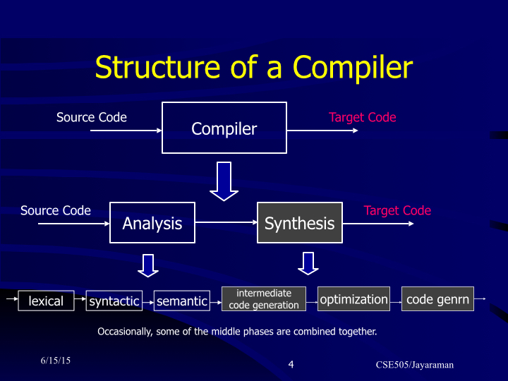
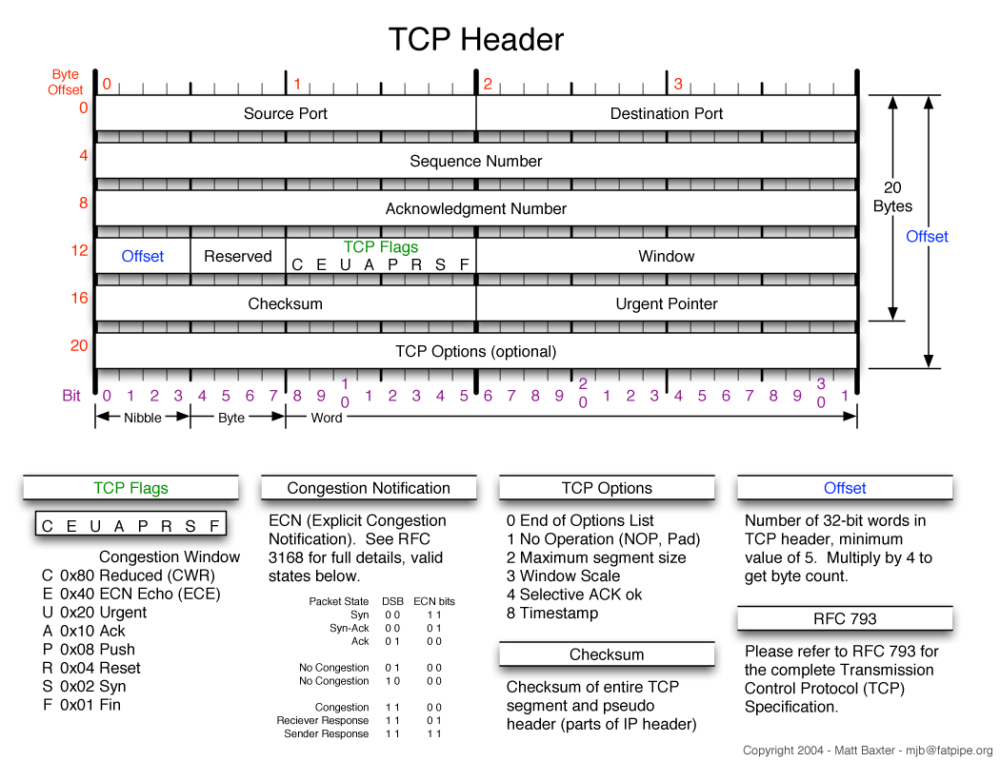
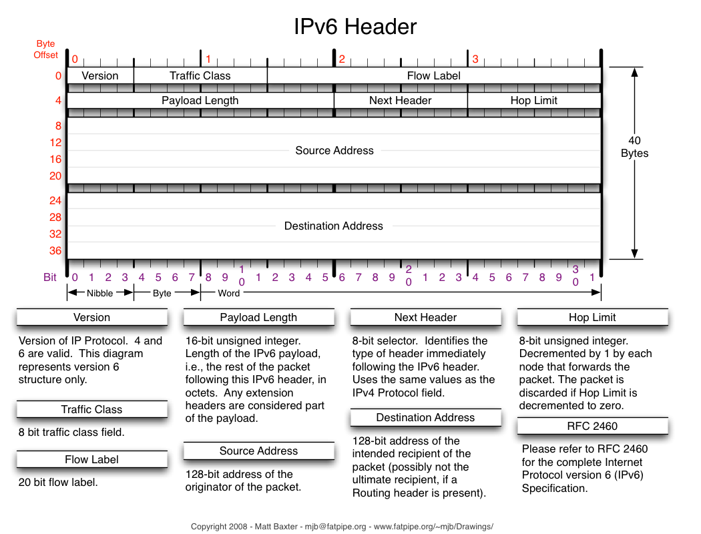

# Java

## General

### final vs finally vs finalize

1. Final is a keyword is used to apply restrictions on class, method and variable. Final class can't be inherited, final method can't be overridden and final variable value can't be changed.
2. Finally is a block used to place important code, it will be executed whether exception is handled or not.
3. Finalize is a method used to perform clean up processing just before object is garbage collected.

### Interface vs Abstract Class

| Differences | Interface                                                                                        | Abstract Class                                     |
|-------------|--------------------------------------------------------------------------------------------------|----------------------------------------------------|
| Methods     | All methods are *implicitly public abstract* and must be                                         | allow both abstract method or non-abstract methods |
| Fields      | All variables are *implicitly public final* and must be (but could set to static or non-static). | allow all kinds of variables.                      |
| Implement   | A class can implement *multiple* interfaces                                                      | only extends *one* abstract class.                 |

## JVM

### What is JVM?

In short, JVM is an abstract computing machine, is used for executing Java byte code, running Java program. It's an implementation of JVM specification.
It has specification defined by Java Oracle, any program that implements the specification is a JVM.

### What does System.gc() and Runtime.gc() methods do ?

These methods only suggest JVM to start a garbage collection.
However, this it is up to JVM to start the garbage collection immediately or later in time.

### When is the finalize() called ? What is the purpose of finalization?

The finalize method is called by the garbage collector, just before releasing the object’s memory. It is normally advised to release resources held by the object inside the finalize method.

### When does GC do its job?

GC decides when to do GC,

### How does GC work?

GC works differently on different generations.

**Heap Structure for GC**
In general, there are 2 partitions of Heap space for GC
- Young generation :
 - 1 Eden space
 - 2 Survivor spaces
- Old generation

**For young generation**:
Generally it's a mark and move operation, the newly created objects will be stored in Eden space,. When eden is full, living objects will be moved and piled up to survivor space. After couple of times of eden to survivor, living objects in survivor space will be moved to the old generation.

To be more specific:
1. Newly created objects will be stored in eden space.
2. When the eden space is full, GC will be performed. Survived objects will be moved and piled up into the survivor space
3. Two survivor spaces are being used as a buffer for each other. At the beginning, we choose one for GC, the other will be empty and waiting for the chosen one to be full. When it's full and garbage collected, the empty one will be used for GC and the chosen one will be cleared and stand by waiting.
4. After a couple of times of above steps, the objects that survived are moved to the old generation.

**For old generation**
Mark-sweep-compact
1. Mark the reachable objects from GC roots as living objects
2. Sweep the space and delete all dead objects
3. Compact the living objects so that the objects are piled up consecutively

**GC Roots**
1. Local variables
2. Active Java threads
3. Static variables
4. JNI References

### What if an object in the old generation need to reference an object in the young generation?

To handle these cases, there is something called the a "card table" in the old generation, which is a 512 byte chunk.
Whenever an object in the old generation references an object in the young generation, it is recorded in this table. When a GC is executed for the young generation, only this card table is searched to determine whether or not it is subject for GC.


### Memory Leaks in Java

**Definition of Memory Leak**: objects are no longer being used by the application, but Garbage Collector can not remove them because they are being referenced.

**How to create a memory leak in Java** :
1. *Mutable Static Fields and Collections* --> are GC roots, they are never garbage-collected.
2. *Thread-Local Variables* -->  thread-local variables will not be removed by the garbage collector as long as the thread itself is alive.
3. *Circular and Complex Bi-Directional References* --> One of them must be reachable from roots.


### Memory Allocation Timing

- Memory (for static variables and assorted control info) is allocated for a class when the class is loaded.
- Memory is allocated for an instance when the instance is created (ie, new).
- Memory is allocated for a method when the method is invoked. (And it doesn't matter whether the method is a static or instance method.)


## Multithreading

### What are the requirements for a deadlock situation?

In general the following requirements for a deadlock can be identified:
- **Mutual exclusion**: There is a resource which can be accessed only by one thread at any point in time.
- **Resource holding**: While having locked one resource, the thread tries to acquire another lock on some other exclusive resource.
- **No preemption**: There is no mechanism, which frees the resource if one thread holds the lock for a specific period of time.
- **Circular wait**: During runtime a constellation occurs in which two (or more) threads are each waiting on the other thread to free a resource that it has locked.

### Is it possible to prevent deadlocks at all?

In order to prevent deadlocks one (or more) of the requirements for a deadlock has to be eliminated:
- **Mutual exclusion**: In some situation it is possible to prevent mutual exclusion by using optimistic locking.
- **Resource holding**: A thread may release all its exclusive locks, when it does not succeed in obtaining all exclusive locks.
- **No preemption**: Using a timeout for an exclusive lock frees the lock after a given amount of time.
- **Circular wait**: When all exclusive locks are obtained by all threads in the same sequence, no circular wait occurs.

### How to avoid deadlock?

**How do you ensure that N threads can access N resources without deadlock ?**
A very simple way to avoid deadlock while using N threads is to impose an ordering on the locks and force each thread to follow that ordering. Thus, if all threads lock and unlock the mutexes in the same order, no deadlocks can arise.

[Stackoverlow](http://stackoverflow.com/questions/1057054/how-to-avoid-deadlocks) - One way is to use a hierarchy of critical sections. If you ensure that a parent critical section is never entered within one of its children, deadlocks cannot happen. **The difficulty is to enforce this hierarchy**.


### Is it possible to implement a deadlock detection?

When all exclusive locks are monitored and modelled as a directed graph, a deadlock detection system can search for two threads that are each waiting on the other thread to free a resource that it has locked., cycle-detection The waiting threads can then be forced by some kind of exception to release the lock the other thread is waiting on.


### Write a program that will surely go into deadlock

An easy way to avoid deadlock is to give some total ordering to resources and impose a rule that resources are only ever acquired by threads in order. Conversely, a deadlock can be intentionally created by running threads that acquire resources, but do not acquire them in order.

**For example:**
```java
class DeadLockExample {
	Lock lock1;
	Lock lock2;

	public void deadlock() {
		lock1.lock();		
		lock2.lock();
		// processing...
		lock1.unlock();
		lock2.unlock();
	}

	public void noDeadlock() {
		lock1.lock();		
		lock2.lock();
		// processing...
		lock2.unlock();
		lock1.unlock();
	}
}
```

### What is a livelock?

A livelock is a situation in which two or more threads block each other by responding to an action that is caused by another thread. In contrast to a deadlock situation, where two or more threads wait in one specific state, the threads that participate in a livelock change their state in a way that prevents progress on their regular work. An example would be a situation in which two threads try to acquire two locks, but release a lock they have acquired when they cannot acquire the second lock. It may now happen that both threads concurrently try to acquire the first thread. As only one thread succeeds, the second thread may succeed in acquiring the second lock. Now both threads hold two different locks, but as both want to have both locks, they release their lock and try again from the beginning. This situation may now happen again and again.


### What do we understand by the term race condition?

A race condition describes constellations in which the outcome of some multi-threaded implementation depends on the exact timing behavior of the participating threads. In most cases it is not desirable to have such a kind of behavior, hence the term race condition also means that a bug due to missing thread synchronization leads to the differing outcome. A simple example for a race condition is the incrementation of an integer variable by two concurrent threads. As the operation consists of more than one single and atomic operation, it may happen that both threads read and increment the same value. After this concurrent incrementation the amount of the integer variable is not increased by two but only by one.

### What is lock contention?

Lock contention occurs, when two or more threads are competing in the acquisition of a lock. The scheduler has to decide whether it lets the thread, which has to wait sleeping and performs a context switch to let another thread occupy the CPU, or if letting the waiting thread busy-waiting is more efficient. Both ways introduce idle time to the inferior thread.

### Which techniques help to reduce lock contention?

In some cases lock contention can be reduced by applying one of the following techniques:
- The scope of the lock is reduced.
- The number of times a certain lock is acquired is reduced (lock splitting).
- Using hardware supported optimistic locking operations instead of synchronization. • Avoid synchronization where possible.
- Avoid object pooling.


### What rules to follow in order to implement an immutable class?

- All fields should be final and private.
- There should be not setter methods.
- The class itself should be declared final in order to prevent subclasses to violate the principle of immutability. • If fields are not of a primitive type but a reference to another object:
 - There should not be a getter method that exposes the reference directly to the caller.
 - Don’t change the referenced objects (or at least changing these references is not visible to clients of the object).


## Misc

### What is difference between fail-fast and fail-safe ?

The Iterator’s fail-safe property works with the clone of the underlying collection and thus, it is not affected by any modification in the collection. All the collection classes in java.util package are fail-fast, while the collection classes in java.util.concurrent are fail-safe. Fail-fast iterators throw a ConcurrentModificationException, while fail-safe iterator never throws such an exception.

### What is the difference between Exception and Error in java ?

Exception and Error classes are both subclasses of the Throwable class. The Exception class is used for exceptional conditions that a user’s program should catch. The Error class defines exceptions that are not excepted to be caught by the user program.

### Path vs ClassPath

**What is PATH and CLASSPATH in Java?**
**Path** is an environment variable which is used by the operating system to find the executables, like javac, java JDK binaries.

**Classpath**  is the path for java compiler and JVM to search for classes and other resource files.
[More details about Classpath](https://www.evernote.com/shard/s424/nl/68417305/f92b971e-65e6-4510-ab3a-84c0e85e2024/)

Path refers to the system while classpath refers to the Developing Envornment.

---

# Programming Languages In general

## Compiler vs Interpreter

### Compiler Structure



1. **Lexical**:    translates sequence of characters into sequence of ‘tokens’
2. **Syntactic**: translates sequence of tokens into a ‘parse tree’;   also builds symbol table
3. **Semantic**: traverses parse tree and performs global checks, e.g. type-checking, actual-parameter correspondence
4. **Intermediate code generation**: Traverses parse tree and generates ‘abstract machine code’,  e.g. triples, quadruples
5. **Optimization**: Performs control and data flow analysis;  remove redundant ops, move loop invariant ops outside loop
6. **Code generation**: Translate intermediate code to actual machine code.

()Occasionally, some of the middle phases are combined together.)

### Interperter


## Programming Paradigms

### 1.Procudural programming

- Inspired by turing machine, straightforward abstractions of the way a traditional turing machine works.
- Execution of computational steps in an order governed by control structures(e.g if, else, for).
- Abstracts one or more actions to a procedure, which can be called as a single command.

### 2.OO Programming

- It models human interaction with real world scenario.
- Data and operations are encapsulated in objects
- Benefits
 - Reusability of code.
 - Easy maintenance and flexibility of code.
 - Increased understanding of code.

### 3.Functional Programming (ML, Lisp)

- It's close to lambda calculus.
- All computations are done by applying (calling) functions, or to put it differently: where the fundamental operation is reduction (of applicative term).
- Functions are first-class values.

### 4.Logic Programming(and constraints programming)

- e.g. (Prolog)
- Discipline and idea: Automatic proofs within artificial intelligence.
- Based on axioms, inference rules, and queries.
- Program execution becomes a systematic search in a set of facts, making use of a set of inference rules.


## Functional Programming Features

### Pattern matching (e.g Haskell, ML)

Pattern matching is a dispatch mechanism: choosing which variant of a function is the correct one to call. It's kind of like function overloading in OOP.
**Advantages**:
1. It's very concise when coding compared to OOP's overloading
2. The compiler will tell you if you left out a case, pretty safe.
3. It's very expressive, you can use it to express your intent in such a way (E.g. check null).

### Lazy evaluation:

Lazy Evaluation is that we do not evaluate a function’s arguments before entering the function body.
**Advantages**:
1. supports conceptually infinite data structures, e.g. game trees;
2. avoids unnecessary list generation;

### Higher-order function:   

Allow functions as arguments and results of other functions.
**Applications:**
- Currying
- Anonymous and nested functions
- Performant recursion through tail call optimization

### What we gain from Functional Programming style

- Elegance and simplicity.
- Easier decomposition of problems.
- Code more closely tied to the problem domain.

And through above these,we can also achieve:
- Straightforward unit testing.
- Easier debugging.

## Compiled language vs Interpreted language

## Static typing vs Dynamic typing

**Static typing**
- Verifying the type safety of a program based on analysis of a program's source code.
- Static typing advocates believe programs are more reliable when they have been well type-checked.
- It allows many bugs to be **caught early (at compile time)** in the development cycle.
- Static typing usually results in compiled code that executes more **quickly**. When the compiler knows the exact data types that are in use, it can produce optimized machine code.
- E.g. ML,  C, C++, C#, Java, Scala, Go...

**Dynamic typing**
- Verifying the type safety of a program at runtime.
- Advocates of dynamically typed languages claim they better support rapid prototyping and that type errors are only a small subset of errors in a program.
-  Simpler languages.
-  Smaller source code size because fewer and/or shorter declarations.
-  Lack of compile time, meaning quicker turnaround.
-   MetaProgramming easier and simpler because you don't have Nanny State typing system complaining
-  Better reuse because less likely to be tied to complex, heavily-defined structures/types and easier to mock up replacements.
- E.g. Javascript, Ruby, Python, PHP, Objective -C, MATLAB …

**Combining static and dynamic type-checking**
- Many useful features or properties are **difficult or impossible to verify statically**, such as downcasting. Therefore, many languages will have both static and dynamic type-checking; the static type-checker verifies what it can, and dynamic checks verify the rest.
- The presence of static type-checking in a programming language does not necessarily imply the absence of dynamic type-checking.

## Java vs Python

| Java | Python |
| -------- | --------|
| Compile then interpret | Interpreted |
| Strong Static Typing | Strong Dynamic Typing  |
| Totally OO Language | OO + Functional features <br/> (list generator, higher order functions, lambda expression)	|
| Platform independent (JVM) | Not independent |
| generally run slower | generally run faster |


---

# OOAD

## [Polymorphism](http://en.wikipedia.org/wiki/Polymorphism_%28computer_science%29)

It's the ability to present the same interface for different underlying forms.
 - function overloading ---> ad hoc polymorphsim
 - generics ---> parametric polymorphism
 - classes or interfaces could have different behaviors based on its subtype ---> subtyping polymorphism (OOP)

## Encapsulation

Encapsulation provides objects with the ability to hide their internal characteristics and behavior.

**Advantages:**
- It increases the **usability** and **maintainability** of code, because the behavior of an object can be independently changed or extended.
- It improves **modularity** by preventing objects to interact with each other, in an undesired way.

## Inheritance

Inheritance provides an object with **the ability to acquire the fields and methods** of another class, called base class.
It greatly improved the **re-usability** of code and can be used to add additional features to an existing class, without modifying it.


## [Cohesion vs. Coupling](http://freefeast.info/difference-between/difference-between-cohesion-and-coupling-cohesion-vs-coupling/)

|  Cohesion  |  Coupling  |
| -------- | ------ |
|   Cohesion is the indication of the relationship within module. 	 |  Coupling is the indication of the relationships between modules.|
|   Cohesion shows the module’s relative functional strength. 	 |  Coupling shows the relative independence among the modules.  |
|   Cohesion is a degree (quality) to which a component / module focuses on the single thing. 	 |  Coupling is a degree to which a component / module is connected to the other modules.  |
|   Cohesion is Intra – Module Concept.  |  Coupling is Inter -Module Concept.  |

[Wiki Cohesion](http://en.wikipedia.org/wiki/Cohesion_%28computer_science%29)
[Wiki Coupling](http://en.wikipedia.org/wiki/Coupling_%28computer_programming%29)


## Association vs Composition vs Aggregation

### The Using relationship: Association

**Association** is a relationship where all objects have their own lifecycle and there is no owner.  Every object has there own lifecycle.
*E.g. I have a relationship with an object. Foo uses Bar.*
```java
public class Foo {
    void Baz(Bar bar) {
    }
};
```

### The Using relationship with Parent: Aggregation

**Aggregation** is a specialised form of Association where all objects have their own lifecycle, but there is ownership and child objects can not belong to another parent object.  We can think about it as a “has-a” relationship.
*E.g. I have an object which I've borrowed from someone else. When Foo dies, Bar may live on.*
```java
public class Foo {
    private Bar bar;
    Foo(Bar bar) {
       this.bar = bar;
    }
}
```

### The Death relationship: Composition

**Composition** is specialised form of Aggregation and we can call this as a “death” relationship. It is a strong type of Aggregation. Child object does not have its lifecycle and if parent object is deleted, all child objects will also be deleted.
*E.g. I own an object and I am responsible for its lifetime, when Foo dies, so does Bar.*
```java
public class Foo {
    private Bar bar = new Bar();
}
```

### Compare

| Associate      |     Aggregation |   Composition   |
| -------- | --------| ------ |
| No owner |   Single owner |  Single owner  |
| Have their own lifetime | Have their own lifetime | Owner's life time |
| Child objects all are independent | Child objects belong to a single parent | Child objects belong to a single parent |

[Details](http://www.codeproject.com/Articles/330447/Understanding-Association-Aggregation-and-Composit# Requirement1%28TheISArelationship%29)
[Stackoverflow Related Question](http://stackoverflow.com/questions/885937/difference-between-association-aggregation-and-composition)


## Overloading and Overriding

**Overloading** is two or more methods have the same function name and return type but have different argument list in the same class.
**Overriding** is when a child class redefines the same method of a parent class.. The overridden method must have the same name, argument list, and return type.


## Dependency injection


---

# Design Pattern

## [Factory Method](https://en.wikipedia.org/wiki/Factory_method_pattern)


### Intention & Usage

To deal with the problem of creating objects without specifying the exact class of object that will be created.
To separate creating different objects from other logic.
To reuse the same logic only the objects creation logic is different.

### Implementation

This is done by creating objects via calling a factory method—either specified in an interface and implemented by child classes, or implemented in a base class and optionally overridden by derived classes—rather than by calling a constructor.

## [Abstract Factory](https://en.wikipedia.org/wiki/Abstract_factory_pattern)


### Factory Method vs Abstract Factory


## [Builder](https://en.wikipedia.org/wiki/Builder_pattern)

 An object creation software design pattern.


### Intention & Usage

The increase of object constructor parameter combination could leads to an exponential list of constructors, need to use numerous constructors. The Builder pattern is used to avoid such a case,

#### Why use another Builder class to build()?

Builder class is like a container who will not build() until all the wanted fields are set, it reverses the process: without a Builder, we need to create a class first then set fields, with a Builder, we set fields first then create a new class, it ensures all fields are set when we have the returned new class();

### Implementation

The builder pattern uses another object, a builder, that receives each initialization parameter step by step and then returns the resulting constructed object at once.
```java
class User{
	private String name;
	privateint id;
	private int age;
	private int phone;
	...
	// Set to private to force client side to use UserBuilder
	private User(UserBuilder builder){
		// ...
	}

	public static class UserBuilder {
		private String name;
		private int id;
		private int age;
		private int phone;
		...

		// frequently used Builder constructors ...
		public UserBuilder (String name) {...}
		public UserBuilder (String name, int id) {...}

		// setter methods
		public UserBuilder name(int id) { ... }
		public UserBuilder age(int age) { ... }
		public UserBuilder phone(int phone) { ... }

		// build
		public User build() {
			...
			return new User(...);
		}
	}
}

public static void main(String[] args) {
	User user = new User.UserBuilder("Sam").age(22).id(11).build();
}
```

### Differences between others

Unlike the abstract factory pattern and the factory method pattern whose intention is to enable polymorphism, the intention of the builder pattern is to find a solution to the telescoping constructor anti-pattern.


## [Decorator](https://en.wikipedia.org/wiki/Decorator_pattern)

### Intention & Usage

It can be used to extend (decorate) the functionality of a certain object statically, or in some cases at run-time, independently of other instances of the same class, provided some groundwork is done at design time.

### Implementation

This is achieved by designing a new decorator class that wraps the original class.
This wrapping could be achieved by the following sequence of steps:
1. Subclass the original "Component" class into a "Decorator" class (see UML diagram);
2. In the Decorator class, add a Component pointer as a field;
3. Pass a Component to the Decorator constructor to initialize the Component pointer;
4. In the Decorator class, redirect all "Component" methods to the "Component" pointer; and
5. In the ConcreteDecorator class, override any Component method(s) whose behavior needs to be modified.


## State

Why use it?


# Database/SQL

## Column-Store vs Row-Store

Vertica is a cluster-based column-store database designed for running batch analytics.
Vertica uses the relational model with an enforced schema.
Vertica is an ACID-compliant distributed database with sophisticated and costly mechanisms to maintain all of these operational parameters, therefore it trades availability for consistency. It also suffers from potentially high latency on writes if some nodes are responding slowly.

**What is Column-Store:**
Column-Store database stores data records as a sequence of columns rather than as a sequence of rows.

**Column-Store VS Row-Store**

| Comparison | Column-store | Row-store |
| ------- | -------| ------ |
| Store |   Store tuples vertically <br/> each column is a tuple  <br/> each row stores the same type of data |  Store each tuple as a row  |
| Read | **A lot more easier** <br/> No need for projection <br/> just read specific rows <br/> since each row stores column data | Need to read all the data, then do a projection <br/> Might have to read some useless data |
| Insert <br/> Update <br/> Delete <br/> | More complex than row-store <br/> Need to operate on each row | **Easier to insert/update/delete** <br/> Just operate on one row |
| Compression | **better for compression** <br/> since each row has the same type of data | Much harder to do |
| Parallel/Distributed | **Easier to be distributed/paralleled** <br/> Data is already vertically partitioned | Need to partition the table vertically <br/> Parallel processing is harder on rows |
| In general | **Faster for batch operations, read operations** | **Faster for operations on a single tuple or a complete tuple ** |
| Use case | **OLAP-like applications** (Read heavy, aggregate heavy cases): <br/> Analytic applications <br/> Data ware housing applications | **OLTP-like applications**: <br/> Interactive transaction applications |

  


## SQL

### Left Outer Join

returns all rows from the left table with the matching rows in the right table (it returns all the rows from the left table even if there are no matches in the right table).

### Right Outer Join

returns all rows from the right table with the matching rows in the left table

### Union

Union merges two datasets that have the structure into one single dataset which does not contain duplicates.
UNION ALL will include duplicate records.

### Where vs Having

WHERE and HAVING both filters out records based on one or more conditions.
The difference is, WHERE clause can only be applied on a static non-aggregated column whereas we will need to use HAVING for aggregated columns.

---

# Unix/Shell


---

# OS


---

# Network

## Routing

Routing是指在Network Layer(OSI model的第三层)，将数据包(data packet)从一个节点以最优路径发送到目标节点的实现方法。
其核心包括：
- 如何获得邻近节点的信息，
- 如何估计链路质量，
- 如何寻址，
- 如何构建网络拓扑结构等等。

通过路由器之间的routing protocol，可以实现两个网络节点之间信息(包括网络域名，邻近节点，链路质量等)的交换和散布，通过不断重复该过程，每个节点都会获得足够多关于所在网络的拓扑信息。当有数据包需要传送时，路由器再通过routing algorithm计算传递当前数据包的最优路径，并把数据包发送给下一个邻近节点。许多routing algorithm基于图理论，实现了*最小生成树*，*最短路径*等等经典的拓扑算法。

直观而言，network routing的过程就相当于传统意义上的邮包寄送，IP地址可以类比于邮政编码，路由器就相当于邮局，通过目的地邮政编码与邮局系统中的递送路径进行比较，由此确定下一步应该把当前包裹传递到哪里。

## Transmission Control Protocol，TCP

### TCP Header




### Reliable Protocol

TCP是一种可靠的传输协议，即在网络条件正常的情况下，TCP协议能够保证接收端收到所有数据，并且接收到的数据顺序与发送端一致。**TCP通过在发送端给每个数据包分配单调递增的sequence number，以及在接受端发送ACK(acknowledgement)实现可靠传输**。每个发送的数据包都包含序列号，当接收端收到数据包时，会发送ACK告诉发送端当前自己期待的下一个序列号是多少。


To assure correctness a checksum field is included. The TCP checksum is a weak check by modern standards. Data Link Layers with high bit error rates may require additional link error correction/detection capabilities. The weak checksum is partially compensated for by the common use of a CRC or better integrity check at Data link layer, below both TCP and IP, such as is used in PPP or the Ethernet frame.

### Flow Control

TCP使用了end-to-end flow control以**避免发送端发送数据过快导致接收端无法处理**。**TCP采用了滑动窗口(sliding window)实现流量控制**。接收端**通过ACK告诉发送端自己还能够接收多少数据**，发送端不能发送超过该值的数据量。当接收端返回的窗口大小为0时，发送端停止发送数据，直到窗口大小被更新。由于ACK是由发送端发送的数据触发，可能接收端窗口已经打开，但是由于发送端已经停止发送，故接收端没有机会通过ACK告知发送端新的窗口大小，在这种情况下会造成死锁。在实际实现中，发送端会设置一个timer，如果timer到期，发送端会尝试发送小数据包，以触发接收端的ACK。

### Congestion Control

**为了控制传输速度防止堵塞网络**，并且在网络容量允许的范围内尽可能多地传输数据，TCP引入congestion control，用以判断当前的网络负荷，并且调整传输速率。For each connection, TCP maintains a congestion window, limiting the total number of unacknowledged packets that may be in transit end-to-end. This is somewhat analogous to TCP's sliding window used for flow control. TCP通常采用additive increase，multiplicative decrease的算法，即**如果 *按时* 收到对应的ACK，则下一次传输速率线性增加，否则则视为发生了网络堵塞，下一次传输的比特数折半**。所谓的“按时”基于RTT：发送端会估计RTT，并且期望当数据包发送以后，在RTT时间内收到对应的ACK。现代TCP需要分别实现Slow-start，congestion avoidance，fast retransmit和fast recovery，以达到最高的效率。

---

## User Datagram Protocol，UDP

相比于TCP，UDP简单许多：连接建立时不需要经过类似于TCP的三次握手，只需要知道接收端的IP和端口，发送端就可以直接发送数据。同时，UDP也没有ACK，flow control和congestion control，故UDP本身不能保证传输是可靠的。由于UDP本身只负责把数据传输到目的地，故可扩展性比较强。有些应用可以实现基于UDP 的特定算法，使得传输效率高于TCP。例如，当发生丢包时，TCP会重传该数据包，但该操作增加了传输延时。对于某些实时性要求较高的应用，可能继续传输新的数据更为重要，故基于UDP的传输方式可以更好地满足该要求。

**UDP Header**


---

## TCP vs UDP

| TCP | UDP |
| ------| ------ |
| Reliable transmission | Unreliable |
| checksum --> ensure data integrity | also has checksum |
| Sequence number + ACK --> Ordered and complete data | Not guaranteed |
| Flow control mechanism (sliding window) | None |
| Congestion control mechanism | None |
| More overhead on header to ensure reliability | lightweight header, good for real time application |

通常而言，如果需要满足可靠性，有序接收，自适应带宽等要求，应该优先考虑TCP，因为其协议本身确保了这点。如果对实时性要求较高，或者应用需要特定的网络传输特性，则可以实现基于UDP的传输协议。往往，这样的协议需要实现congestion control，flow control，retransmission等机制，故通常情况下都可以直接采用TCP以减小开发成本。

---

Difference between TCP and UDP (Another version)
| TCP  |	UDP |
| ------| ------ |
|**Reliability**: TCP is connection-oriented protocol. When a file or message send it will get delivered unless connections fails. If connection lost, the server will request the lost part. There is no corruption while transferring a message.|**Reliability**: UDP is connectionless protocol. When you a send a data or message, you don't know if it'll get there, it could get lost on the way. There may be corruption while transferring a message.|
|**Ordered**: If you send two messages along a connection, one after the other, you know the first message will get there first. You don't have to worry about data arriving in the wrong order.|**Ordered**: If you send two messages out, you don't know what order they'll arrive in i.e. no ordered|
|**Heavyweight**: - when the low level parts of the TCP "stream" arrive in the wrong order, resend requests have to be sent, and all the out of sequence parts have to be put back together, so requires a bit of work to piece together.|**Lightweight**: No ordering of messages, no tracking connections, etc. It's just fire and forget! This means it's a lot quicker, and the network card / OS have to do very little work to translate the data back from the packets.|
|**Streaming**: Data is read as a "stream," with nothing distinguishing where one packet ends and another begins. There may be multiple packets per read call.	|**Datagrams**: Packets are sent individually and are guaranteed to be whole if they arrive. One packet per one read call.|

**TCP Example**: World Wide Web (Apache TCP port 80), e-mail (SMTP TCP port 25 Postfix MTA), File Transfer Protocol (FTP port 21) and Secure Shell (OpenSSH port 22) etc.
**UDP Example**: Domain Name System (DNS UDP port 53), streaming media applications such as IPTV or movies, Voice over IP (VoIP), Trivial File Transfer Protocol (TFTP) and online multiplayer games etc|

---

## ICMP

**ICMP Header**


---

## IP

**IP Header**





---

## HTTP Get vs POST

**Get** is to request data from the server. We send the data by appending it on the url.

**Post** is to request the web server to accept the data. The data is enclosed in the body of the request. (E.g. submit a form, upload a file).

| Differences | Get | Post |
| ------- | -------| ------ |
| data length | 2048 max URL length |  *no limit*  |
| data type | only ASCII characters allowed | *no restriction* |
| security | less secured <br/> because appending to URL, data is visible | *safer than GET* |
| Cache | *can be cached* | usually are not cached |
| Bookmark | *can be bookmarked* | cannot |
| Back / Reload | *it's harmless* | data will be re-submitted. |


## What are the HTTP Request Methods

- **Get**: Request data from server
- **Post**: Sending data to server, asking for create such a resource under the URI.
- **Put**:  Like post, it can create a resource, besides it can also update a resource if one exists.
- **Delete**: Deletes the specified resource.
- **Head**: Same as Get, but the response has only header, without the response body.
- **Trace**: Performs a message loop-back test along the path to the target resource.
- **Options**: Returns the HTTP methods that the server supports for the specified URL.
- **Connect**: Converts the request connection to a transparent TCP/IP tunnel, usually to facilitate SSL-encrypted communication (HTTPS) through an unencrypted HTTP proxy
- **Patch**: Applies partial modifications to a resource.

## RESTful

It is an architectural style.
It has several features:
1. It uses a client-server model, and the communication must be stateless, like HTTP.
2. All resources can be identified by an URI, it uses URI to identify resources.
3. It uses HTTP methods as verbs to do CRUD operations on resources, and all the name of interfaces should be noun.

Uniform interfaces: all resources are identified by URIs
It relies on a stateless communications protocols (think: HTTP).
Interaction with resources is via a set of standard methods (think: HTTP verbs)

## Cookie vs Session

*Because HTTP is stateless, cookie and session are used for introducing previous state.*

### Cookie

is a set of key-value pairs stored in a user's browser as a text file (sent from a website).
*other attributes*: Domain, Path, Expires (date and time to delete)/Max-Age (time interval), Secure, HttpOnly.

### Session

a set of key-value pairs associated with a given user stored in sever side.

### Compare

| Cookie | Session |
| --------| ------ |
| 4Kb limited size | no limitation on size |
| Stored in client side | Stored in server side |
| less secure <br/> (text format in client side) | more secure |
| Is not enabled for every client (some may disabled it) | All available |
| Cookie is identified by browser, domain, path | Session is identified by a unique identifier of the user |
| Cookies will increase network traffic <br/> because it may sent to the server with every request | Much less traffic cost, but overhead on server |
| can be accessed only under the domain/path | can be accessed across any requests for the same user |
| Usually is persisted in file | Usually stored in memory as Object |

## [check sum](http://en.wikipedia.org/wiki/Checksum)

check sum is a hash value hashed from a block of data for the purpose of detecting errors, checking data integrity. It is usually used during data transmission or storage.
Usage:
**IPv4 header checksum** -- error detection, calculated only for the header bytes (with the checksum bytes set to 0), is 16 bits long and is a part of the IP packet header.
[IPv4 header checksum Details](http://en.wikipedia.org/wiki/IPv4_header_checksum)
**MD5** -- a compact digital fingerprint of a file
[MD5 Details](http://en.wikipedia.org/wiki/Md5sum)

---

# Distributed System


---

# Misc

## XML, JSON

### What is difference between XML Schema and DTD?

`syntax`
The critical difference between DTDs and XML Schema is that XML Schema utilize an XML-based syntax, whereas DTDs have a unique syntax held over from SGML DTDs.
`goal`
The goal of DTDs was to retain a level of compatibility with SGML for applications that might want to convert SGML DTDs into XML DTDs. However, in keeping with one of the goals of XML, "terseness in XML markup is of minimal importance," there is no real concern with keeping the syntax brief.

[More details](http://stackoverflow.com/questions/1544200/what-is-difference-between-xml-schema-and-dtd)


## Test

### What is unit test?

The process to test the small, relatively independent parts of an application, it's white-box test usually conducted by programmer itself. The goal is to test if  every execution path works as expected, and if it can handle all the  cases, especially for corner cases.

### What is integration test?

Sometimes called integration and testing. It's to combine software modules together, and test it as a group. The goal is to verify functionality, performance, and reliability of the integrated system.
It's a black box test.

### What is smoke test?

Smoke testing is non-exhaustive software testing, is to verify the most crucial functions of a program work, but not bothering with finer details.

### What is regression test?

A test that was written when a bug was fixed. It ensures that this specific bug will not occur again.


---
